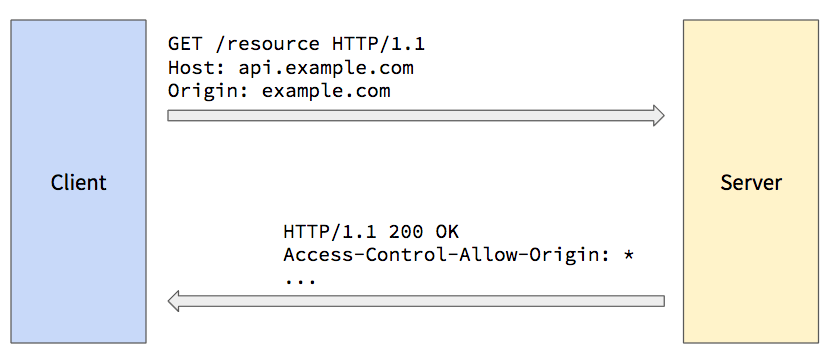
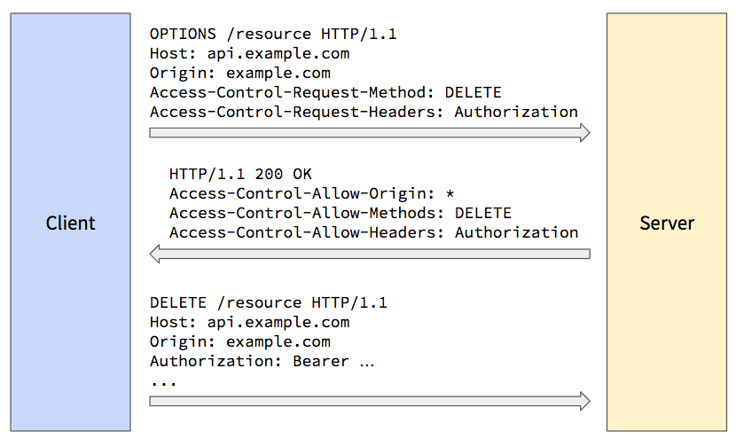

> **WARNING:** this tutorial assumes you have a good working knowledge of HTTP. If you don't, read the [HTTP tutorial](../http/) first.

Back in the early 2000s, web browsers started allowing JavaScript to make HTTP requests without requiring a page navigation. This was very exciting, as it enabled a new form of web application that felt more like a native desktop application. But the browser vendors faced a difficult question: should we allow JavaScript to make requests to a different [origin](../http/#secorigin) than the origin the current page came from? In other words, should JavaScript loaded into a page served from `example.com` be able to make HTTP requests to `example.com:4000` or `api.example.com` or even `some-other-domain.com`?

On the one hand, browsers have always allowed page authors to include images and script files served from other origins: this was how one could include a JavaScript library file hosted on a [Content Delivery Network (CDN)](https://en.wikipedia.org/wiki/Content_delivery_network). Fetching these resources resulted in an HTTP request to a different origin, so why not let JavaScript do that directly?

On the other hand, there were some very significant security concerns with allowing cross-origin requests initiated from JavaScript. Many sites use cookies to track authenticated sessions, and browsers automatically send any cookies they have for an origin when they make a request to it. If a user was signed-in to a sensitive site like their bank, and if that user was lured to a malicious page on `evil.com`, JavaScript within that page could easily make HTTP requests to the user's bank, and the browser would happily send along the authenticated session cookie. Thus the malicious page could conduct transactions on the user's behalf without the user even knowing that it's occurring.

Not surprisingly, the browser vendors decided to restrict cross-origin HTTP requests made from JavaScript. This posed issues for emerging web services that wanted to provide APIs that were callable from any web application, regardless of what origin the application came from.

Several creative hacks were developed to make this possible, the most popular being the [JSONP technique](https://en.wikipedia.org/wiki/JSONP). But these were always acknowledged as short-term hacks that needed to be replaced by a long-term solution. The great minds of the Web got together to figure out how to enable open API servers without compromising security. The result was the [Cross-Origin Resource Sharing](https://www.w3.org/TR/cors/) standard, more commonly referred to as CORS.

## How CORS Works

The CORS standard defines new HTTP headers and some rules concerning how browsers and servers should use those headers to negotiate a cross-origin HTTP request from JavaScript. The rules discuss two different scenarios: simple requests; and more dangerous requests that require a separate preflight authorization request.

### Simple Requests

Simple cross-origin requests are defined as follows:

- The method is GET, HEAD, or POST
- The request may contain only ["simple" headers](https://www.w3.org/TR/cors/#terminology), such as `Accept`, `Accept-Language`, `Content-Type`, and `Viewport-Width`.
- If a `Content-Type` header is included, it may only be one of the following:
	- `application/x-www-form-urlencoded` (format used when posting an HTML `<form>`)
	- `multipart/form-data` (format used when posting an HTML `<form>` with `<input type="file">` fields)
	- `text/plain` (just plain text)

If JavaScript in a page makes an HTTP request that meets these conditions, the browser will send the request to the server, adding an `Origin` header set to the current page's origin. The server may use this `Origin` request header to determine where the request came from, and decide if it should process the request.

> **NOTE:** The inclusion of the POST method here opens up a possible attack vector that you must consider. It was included so that existing HTML forms that post cross-origin wouldn't break (e.g., a "contact us" form that posts to an emailing service). But this can be exploited by an attacker if the target of that POST wasn't meant to be called cross-origin. For example, there was a time when the Docker daemon accepted POST requests from the Docker CLI over HTTP, and the POST request conformed to this "simple request" definition: it didn't require any headers beyond those listed above, and it didn't require any post body. That meant that _any_ JavaScript served from _any_ origin could make an AJAX request to that same Docker daemon API! But that API was never meant to be callable cross-origin, so it created a gaping vulnerability. To make matters worse, the Docker daemon wasn't checking the `Origin` header to ensure the request actually came from the local CLI, and not a web page loaded from the Internet. Thankfully, some [security researchers discovered this](https://www.blackhat.com/docs/us-17/thursday/us-17-Cherny-Well-That-Escalated-Quickly-How-Abusing-The-Docker-API-Led-To-Remote-Code-Execution-Same-Origin-Bypass-And-Persistence_wp.pdf), and Docker fixed the vulnerability. The moral of the story is, if your server supports simple POST requests that are not meant to be called cross-origin, you must check the `Origin` header and reject the request if it's not set to what you expect.

If the server does process the request and responds with a 200 (OK) status code, it must also include a response header named `Access-Control-Allow-Origin` set to the value in the `Origin` request header, or `*`. This tells the browser that it's OK to let the client-side JavaScript see the response.



This header protects older servers that were built before the CORS standard, and are therefore not expecting cross-origin requests to be allowed. Since this header was defined with the CORS standard, older servers will not include it in their responses, so the browser will block the client-side JavaScript from seeing those responses.

Supporting simple cross-origin requests on the server-side is therefore as simple as adding one header to your response: `Access-Control-Allow-Origin: *`. If you want to restrict access to only a small set of white-listed origins, you can compare the `Origin` request header against that list and respond accordingly.

### Preflight Requests

If the client-side JavaScript makes a cross-origin request that doesn't conform to the restrictive "simple request" criteria, the browser does some extra work to determine if the request should be sent to the server. The browser sends what's known as a "preflight request," which is a separate HTTP request for the same resource path, but using the `OPTIONS` HTTP method instead of the actual request method. The browser also adds the following headers to the preflight request:

- `Origin` set to the origin of the current page.
- `Access-Control-Request-Method` set to the method the JavaScript is attempting to use in the actual request.
- `Access-Control-Request-Headers` set to a comma-delimited list of non-simple headers the JavaScript is attempting to include in the actual request.

When the server receives the preflight request, it can examine these headers to determine if the actual request should be allowed. If so, the server should respond with a 200 (OK) status code, and include the following response headers:

- `Access-Control-Allow-Origin` set to the value of the `Origin` request header, or `*` (same as in simple request).
- `Access-Control-Allow-Methods` set to a comma-delimited list of HTTP methods the server will allow on the requested resource.
- `Access-Control-Allow-Headers` set to a comma-delimited list of non-simple headers the server will allow in a request for the resource.
- `Access-Control-Expose-Headers` set to a comma-delimited list of **response** headers the browser should expose to the JavaScript if the actual request is sent. If you want the JavaScript to access one of your non-simple response headers (e.g., `Authorization`), you must include that header name in this list. Otherwise the header simply won't be in the response headers returned to the client-side JavaScript.
- `Access-Control-Allow-Credentials` set to `true` if the server will allow the browser to send cookies during the actual request. If omitted or set to `false`, the browser will not include cookies in the actual request.
- `Access-Control-Max-Age` set to the maximum number of seconds the browser is allowed to cache and reuse this preflight response if the JavaScript makes additional non-simple requests for the same resource. This cuts down on the amount of preflight requests, especially for client applications that make repeated requests to the same resources.

All of the following must be true for the browser to then send the actual request to the server:

- The `Access-Control-Allow-Origin` response header matches `*` or the value in the `Origin` request header.
- The actual request method is found in the `Access-Control-Allow-Methods` response header.
- The non-simple request headers are all found in the `Access-Control-Allow-Headers` response header.

If any of these are not true, the browser doesn't send the actual request and instead generates an HTTP error.



## CORS and CSRF Attacks

Supporting CORS naturally exposes your server to Cross-Site Request Forgery (CSRF) attacks, especially if your site uses cookies for authentication. Once you support CORS, an attacker could lure one of your authenticated users to a malicious web page, and use JavaScript in that web page to access your server's APIs on the user's behalf. If the malicious developer sets the `.withCredentials` property on the `XMLHttpRequest` object, or sets the `credentials` property in the options passed to the new `fetch()` API, the browser will send all stored cookies for the target origin with the request, with no warning shown to the user.

The easiest way to protect against a CSRF attack is to simply not use cookies for authentication tokens. Cookies are set using the `Set-Cookie` response header, and provided in requests using the `Cookie` header, and both of these are automatically handled by the browser. If you use some other header that is not automatically handled, such as `Authorization`, the attacker would have to explicitly set that header to the user's current authentication token. Since these tokens are typically stored in Local Storage, and since JavaScript from one origin can't read the Local Storage belonging to another origin, the attacker has no way to access the authentication token, and therefore can't send it with the request.

If you still want to use cookies, and still want to support requests from any origin, there are a few other techniques you can use, including [synchronizer tokens](https://www.owasp.org/index.php/Cross-Site_Request_Forgery_%28CSRF%29_Prevention_Cheat_Sheet#Synchronizer_.28CSRF.29_Tokens), [double submit cookies](https://www.owasp.org/index.php/Cross-Site_Request_Forgery_%28CSRF%29_Prevention_Cheat_Sheet#Double_Submit_Cookie), and the [encrypted token pattern](https://www.owasp.org/index.php/Cross-Site_Request_Forgery_%28CSRF%29_Prevention_Cheat_Sheet#Encrypted_Token_Pattern). 

## CORS Middleware in Go

If you are building a web server that exposes many APIs, and you want many or all of them to be callable from any origin, you will quickly notice that managing all of these headers requires a good bit of code that you don't want to repeat in every handler function. Thankfully we can use a technique called "middleware" to handle this logic in one place.

A middleware handler is simply an `http.Handler` that wraps another `http.Handler` to do some pre- and/or post-processing of the request. It's called "middleware" because it sits in the middle between the Go web server and the actual handler.

A CORS middleware handler would look something like this:

```go
type CORSHandler struct {
	Handler http.Handler
}

func (ch *CORSHandler) ServeHTTP(w http.ResponseWriter, r *http.Request) {
	//use the `Origin` and `Access-Control-Request-*` headers to
	//determine if this request should be allowed
	//for example...
	if r.Header.Get("Origin") == "http://evil.com" {
		http.Error(w, "sorry, no evil requests", http.StatusUnauthorized)
		return
	}

	//set the various CORS response headers depending on
	//what you want your server to allow
	w.Header().Add("Access-Control-Allow-Origin", "*")
	//...more CORS response headers...

	//if this is preflight request, the method will
	//be OPTIONS, so call the real handler only if
	//the method is something else
	if r.Method != "OPTIONS" {
		ch.Handler.ServeHTTP(w, r)
	}
}

func NewCORSHandler(handlerToWrap http.Handler) *CORSHandler {
	return &CORSHandler{handlerToWrap}
}
```

Since a [mux](../goweb/#secmuxes) implements the `http.Handler` interface, you can use this `CORSHandler` to wrap an entire mux, thereby adding CORS support to all the handler functions that are added to that mux:

```go
mux := http.NewServeMux()
mux.HandleFunc("/hello", HelloHandler)
corsHandler := NewCORSHandler(mux)
```

And since `CORSHandler` also implements `http.Handler`, you can pass the CORSHandler to the `http.ListenAndServe()` function as the root handler for the server:

```go
log.Fatal(http.ListenAndServe(addr, corsHandler))
```

With this code, all requests will first go through the `CORSHandler.ServeHTTP()` method, and if the HTTP request method is something other than `OPTIONS`, the request will be sent on to the mux. The mux will then use the requested resource path to determine which handler function to call.

Middleware is a powerful concept that can be used whenever you want to do pre- or post-processing of a request. Since each middleware handler both accepts and is an `http.Handler`, you can combine multiple middleware handlers together into a chain of wrapped handlers, each of which get executed during each request.

For an elegant application of this technique, see Mat Ryer's excellent article [Writing middleware in #golang and how Go makes it so much fun](https://medium.com/@matryer/writing-middleware-in-golang-and-how-go-makes-it-so-much-fun-4375c1246e81).

