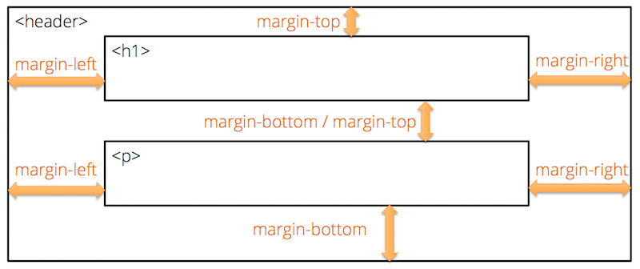
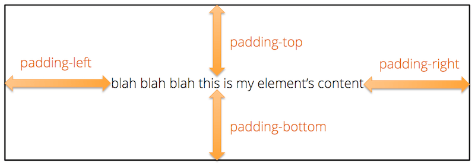

CSS (**C**ascading **S**tyle **S**heets) is a declarative language that we use to alter the appearance of our HTML pages. A CSS file (known as a **stylesheet**) consists of a set of formatting rules. The browser interprets and applies these rules when it renders your web page.

CSS is immensely powerful and flexible. You can control nearly every aspect of an element's appearance, including its overall placement on the page. To give you some idea of just how much control you have, check out the [examples in the CSS Zen Garden](http://www.mezzoblue.com/zengarden/alldesigns/). Every one of those examples uses the exact same HTML page, but they all look completely different because each one uses a different CSS stylesheet.

## Why Two Different Languages?

If you are new to web programming, you might be wondering why there are two different languages: HTML for your page content; and CSS for your formatting rules. Why not just include the formatting right in with the content?

There is an old, tried-and-true principle of programming that is known as the **[separation of concerns](https://en.wikipedia.org/wiki/Separation_of_concerns)**. Good software keeps separate things separate and loosely-coupled so that it's easy to change one without breaking the other. One typical separation that you will see in nearly every information system is the separation between data and the way those data are presented on-screen.

By separating our data from the way they are presented, we achieve a number of benefits:

- Several HTML pages can all share the same CSS file, allowing us to change the look of our entire site by editing only one file.
- The same HTML can be presented to different users in different ways. For example, you could allow users to "skin" the site in one of several different themes, or you could use different default formatting for different regions of the world with different aesthetic sensibilities
- You can also dynamically adjust the look of your page by applying new style rules to elements in response to user interaction (clicking, hovering, scrolling, etc.)

## Adding a Stylesheet to your Page

You can add CSS rules to your page in three different ways, but the best practice is to use a separate CSS stylesheet file, and link that to your HTML page. These stylesheet files are typically put into a `css/` subdirectory to keep them separate from all your HTML pages.

For example, say you wanted to create one stylesheet for your `index.html` page that you created during the [Essential HTML Tutorial](../html/). Create a new directory named `css` next to your `index.html` file. Then create a new file in that new `css/` directory named `styles.css`. The resulting file structure should be like this:

```
myproject/
|-- index.html
|-- css/
    |-- styles.css
```

Now link this new stylesheet to your HTML file by adding the following element to the `<head>` section of your page:

```html
<head>
    ...existing elements... 
    <link rel="stylesheet" href="css/styles.css">
</head>
```

The name you use for your CSS file can be anything you want. It just needs to match what you put in the `href` attribute of the `<link>` element.

## Normalizing Browser Defaults

Each web browser applies a set of default styles to any page it loads, which you can then override in your stylesheets. Unfortunately, these defaults are not completely consistent across all the browsers, so you might end up with a slightly different look in Edge than in Chrome.

Thankfully the web development community has responded by creating [normalize.css](https://necolas.github.io/normalize.css/). This is a CSS stylesheet that simply normalizes all of the browser defaults to one consistent set of base styles, so that you can build upon a solid, uniform, and well-known foundation.

Unless you are using a CSS framework that already includes cross-browser reset rules (e.g., [Bootstrap](https://getbootstrap.com/)), it's good practice to include normalize.css as the first stylesheet you link to from your page. The link to your stylesheet comes after, so that your rules will build upon those defined in normalize.css.

The easiest way to load normalize.css into your page is via [their online version](https://cdnjs.com/libraries/normalize):

```html
<head>   
    <!-- normalize.css -->
    <link rel="stylesheet" href="https://cdnjs.cloudflare.com/ajax/libs/normalize/7.0.0/normalize.min.css">

    <!-- our own stylesheet -->
    <link rel="stylesheet" href="css/styles.css">
</head>
```

Files that end with `.min.css` have been "minified," which just means that all the spaces have been taken out to make the file smaller and faster to download. When loading a library file from an online location like this, always use the `.min.css` version if it's available.

This works well in every case except when you are offline, which can happen when you are doing development. If you need access to normalize.css while offline, [download it](https://necolas.github.io/normalize.css/7.0.0/normalize.css) to your project folder and link to it using a relative path, just like the link to your own stylesheet. By convention, we typically put files like this into a `lib/` folder, to keep them separate from our own files that we actively change.

## Basic Syntax

A CSS stylesheet follows this basic syntax:

```css
/* this is a comment */
selector {
    property: value;
    property: value;
}

selector {
    property: value;
    property: value;    
}

```

A stylesheet is a series of **rules**. A rule starts with a **selector**, which specifies which elements the rule applies to. The selector is followed by a pair of braces, inside of which is a set of formatting properties. Each formatting property consists of a name and a value. The property name is separated from the property value by a colon, and each property/value pair must end with a semi-colon. Don't forget the semi-colon! If you do, the browser will likely ignore that formatting property.

Like most programming languages, multiple whitespace characters are coalesced into one, so the layout of the rule can vary. For example, you can start the braces on the line below the selector, or you can put everything all on one line if you want. But most developers will use the style shown above, as it's easy to read and maintain. For large CSS files, professionals will typically **minify** them before deploying them to a production server, which involves removing all the whitespace to make the file smaller.

You can add comments to your stylesheets by wrapping them with `/*` and `*/`. Comments are ignored by the browser, but can be very helpful for explaining things to other developers (or for reminding yourself about why you did something in a particular way).

## Selectors

There are [many kinds of selectors](http://www.w3schools.com/cssref/css_selectors.asp) supported in CSS, but you will use only a handful in most situations.

### Element Selectors

Element selectors select elements by their element name. For example, this selector will select all `<p>` elements in the page, regardless of where they exist.

```css
p {
    ...
}
```

### Class Selectors

Class selectors select elements by the value of their `class` attribute. Every HTML element can have a `class` attribute set to one or more class names. Multiple class names are separated by a space, and for obvious reasons, your class names can't contain spaces. For example, this paragraph element has two class names: `alert` and `alert-warning`.

```html
<p class="alert alert-warning">...</p>
```

After you add a class attribute to an element, you can then refer to that class in your CSS using a class selector. Class selectors look like this:

```css
/* selects all elements with class="alert" */
.alert {
    ...
}

/* selects all elements with class="alert-warning" */
.alert-warning {
    ...
}

/* selects all elements with class="alert alert-warning" 
(i.e., elements that have both classes) */
.alert.alert-warning {
    ...
}
```

Note the `.` character at the start of the name. That tells the browser that what follows is a class name and not an element name. But remember that the `.` character is used only in the CSS rule; in your HTML `class` attribute, you use the class name without the preceding `.` character.

CSS rules are also additive. If you attach multiple style classes to the same element (like we did above), the browser will combine all formatting properties from all style rules in the order that they are defined. So in the case above, because the paragraph has both the `alert` and `alert-warning` style classes, the browser will combine all formatting properties from the `.alert` and `.alert-warning` rules and apply all of them to the element. If the same property is defined in both rules, the later one will override the earlier one.

Multiple elements within your page can all share common class names, so you can define style classes for common UI components that you use in several places. For example, say you are writing a tutorial and you want to style all new terms you introduce in a particular way. You could define a rule in your stylesheet with the selector `.term`, setting various formatting properties you want to apply to new terms (e.g., bold, yellow background color, etc). 

```css
.term {
    font-weight: bold;
    background-color: yellow;
}
```
When you introduce a new term in your HTML page, simply add the `term` style class to an element that wraps around the term:

```html
<p>A stylesheet is a series of <span class="term">rules</span>. 
A rule starts with a <span class="term">selector</span>, ...</p>
```

### ID Selectors

ID selectors select elements by their `id` attribute. Every HTML element can have an `id` attribute, but unlike the `class` attribute, the value of the `id` attribute must be unique within the page. That is, no two elements can have the same value for their `id` attributes. Thus, the `id` attribute is less flexible than the `class` attribute, and should be used only when you really need to refer to a specific element and only that one element.

ID selectors start with a `#` sign:

```css
/* selects the element with id="my-id" */
#my-id {
    ...
}
```

Since the `id` attribute is commonly used to create bookmark hyperlinks (i.e., links that scroll the page to a particular section of the page), id selectors are a handy way to style those elements.

### Descendant Selectors

All the selectors mentioned so far will select all matching elements regardless of where they are in the HTML element tree. But sometimes you want to style only a set of elements that exist within a particular parent or ancestor element, and not all the other matching elements elsewhere in the page. You can do this kind of targeted selecting using a descendant selector.

For example, say you wanted to style all paragraphs within the `<header>` element, but not the other paragraph elements that exist elsewhere in the page. You can select just those paragraph elements using a selector like this:

```css
/* selects only the p elements contained within header elements */
header p {
    ...
}
```

The syntax is a space-delimited list of selectors, so you can use element or class selectors at each level. You can also have as many levels as you want, but it's best practice to use no more than two or three. For example, to target all elements with the style class `.logo` that exist inside a paragraph that exists inside the header, your selector would look like:

```css
/* selects elements with class="logo" 
contained within p elements
contained within header elements */
header p .logo {
    ...
}
```

Note that descendant selectors will select matching descendant elements  anywhere lower in the tree branch, not just direct children, so the `.logo` elements here could be nested several layers below the `<p>` element. This is usually a good idea because you may introduce new nesting layers to your page as you go along. But if you really want to select only direct children, you can use this variant of the syntax, known as a **child selector**:

```css
/* selects only the p elements that are direct children the header element  */
header > p {
    ...
}
```

### Group Selectors

Sometimes you want to apply the same formatting to several elements, all of which might have different element names or style classes. For example, you might want to set the same font-weight on all the `h1`, `h2`, and `h3` elements. Instead of defining three separate rules, you can use one rule with a group selector:

```css
/* selects all h1, h2, and h3 elements  */
h1, h2, h3 {
    font-weight: 300;
}
```

The syntax is a list of selectors separated by commas. You can use element, class, or even descendant selectors for each element in the list.

Group selectors are an excellent way to adhere to the **DRY principle**: **D**on't **R**epeat **Y**ourself! If you find yourself copying and pasting formatting properties between rules, stop and ask yourself if you can use a group selector instead.

### Hover and Focus Pseudo Selectors

The last types of selectors that you will use quite often are the hover and focus **pseudo-selectors**. These select elements that the mouse is hovering over, or that have the keyboard focus, respectively. You can use these to apply different formatting on hover or focus, usually to indicate that the element is clickable, or to help those with vision impairments notice where the keyboard focus is. The syntax looks like this:

```css
/* selects all elements with class="nav-link" */
.nav-link {
    color: white;
}

/* selects all elements with class="nav-link" that are being hovered over with the mouse */
.nav-link:hover {
    /* change color to red */
    color: red;
}

/* selects all <input> elements that have keyboard focus */
input:focus {
    /* change background color to yellow */
    background-color: yellow;
}
```

### Other Selectors

These are the most common ones you will use, but there are many other kinds of powerful selectors you also have at your disposal for less-common tasks. See the [CSS Selectors Reference](http://www.w3schools.com/cssref/css_selectors.asp) for a complete list.

### Practice Using Selectors

Now take a moment to practice using selectors by playing [CSS Diner!](http://flukeout.github.io/)

## The Cascade

A typically stylesheet will contain lots of rules, so the natural next question is, how do all of these rules combine, and what happens when I define conflicting rules?

Although the actual algorithm is pretty complex, you can think of it this way:

1. The rules are processed in the order that they are defined in the CSS file. If you link multiple CSS files to the same page, the files are processed in the order they are linked in the HTML page.
1. The browser selects the elements matching the rule and applies the formatting properties within the rule.
1. If a later rule selects the same element and provides a different setting for a property already set by an earlier rule, the later rule's setting overrides.


This simple explanation is accurate in most cases, but there are a few cases where it isn't quite right. The CSS standard gives higher priority to some selectors over others, making the order in which they were defined irrelevant in some cases. The concept is known as [Selector Specificity](https://developer.mozilla.org/en-US/docs/Web/CSS/Specificity), and you may run into cases where this becomes important. If you notice that one of your style rules is not being applied, despite your syntax being correct, check your browser's developer tools to see if your rule is being overridden by a more specific rule in an earlier stylesheet. Then adjust your rule so that it has the same or greater specificity.

## Property Inheritance

All CSS properties affect the styling of the elements directly selected by the rule, but [several properties](http://stackoverflow.com/questions/5612302/which-css-properties-are-inherited) also affect the styling of all descendant elements as well. For example, if I set the font family for the `<body>` element, all elements within the body section will use that font unless it is overriden by another rule. 

We call these **inherited** properties, because the descendant elements inherit the setting from their ancestor element. This is a powerful mechanism that enables us to specify these properties only once for a given branch of the element tree. In general, try to set these properties on the highest-level element you can, and let the descendant elements inherit the setting from their ancestor.

## Fonts

Now that you understand the basic syntax and rules, we can now learn how to adjust various visual aspects of our elements, such as fonts, colors, and background images.

By default, browsers will render text with elements using a font from the Times Roman family. This is a [serifed](https://www.fonts.com/content/learning/fontology/level-1/type-anatomy/serif-vs-sans-for-text-in-print) font, which looks good when printed on paper, but doesn't work as well for small text on screens. Most web sites these days use [sans-serifed](https://www.fonts.com/content/learning/fontology/level-1/type-anatomy/serif-vs-sans-for-text-in-responsive-design) fonts for body text, as it tends to be easier to read at smaller point sizes.

To change the font, use the `font-family` property:

```css
/* font-family is inhered, so setting it on body sets it for the whole page */
body {
    font-family: -apple-system, BlinkMacSystemFont, 
        "Segoe UI", "Roboto", "Oxygen", "Ubuntu", 
        "Cantarell", "Fira Sans", "Droid Sans", 
        "Helvetica Neue", sans-serif;
}
```

The value for `font-family` can be a comma-delimited list of font names. If the font name has a space in it, you must wrap the name in quotes, but quotes are optional if the name doesn't contain a space. The browser will attempt to use the first font in the list, but fall back to using those later in the last if the requested font can't be found on the system. At the very end of the list is `sans-serif`, which is a CSS-specific keyword meaning "the default sans-serif font on the system, whatever that happens to be."

A list of fonts like this is known as a **font stack**, and this particular list comes from the article [Using UI System Fonts In Web Design: A Quick Practical Guide](https://www.smashingmagazine.com/2015/11/using-system-ui-fonts-practical-guide/). These are all the default system fonts that ship with recent versions of the major desktop and mobile operating systems.

System fonts are great, but often times you want to use your own font. Thankfully browsers support the ability to dynamically download particular font files and use those when rendering your web page.

The easiest way to use custom fonts is to use one from the [Google Fonts](https://fonts.google.com/) collection. Select the fonts you want to use, and Google Fonts will generate the appropriate `<link>` element for your HTML page.

For example, say you want to use the popular font [Lato](https://fonts.google.com/specimen/Lato) for your body text. Choose the `Select this font` link on the page, and then click the dark bar at the bottom where it says `1 Family Selected`. In the popup window, you'll see this `<link>` element, which you should copy and paste into the `<head>` section of your HTML page:

```html
<head>
    ...
    <link href="https://fonts.googleapis.com/css?family=Lato" rel="stylesheet">
</head>
```

The popup window also shows you how to reference this font in the `font-family` CSS property. Note that it's a good idea to provide at least the `sans-serif` fallback font, just in case the browser is unable to get the font from Google's font servers.

```css
body {
    font-family: Lato, sans-serif;
}
```

By default, the generated `<link>` element will only download the regular weight and normal typeface for the given font. If you want the italic typeface or different weights (e.g., bold, thin, etc), you need to click on the Customize tab in the popup window, and choose the various weights and typefaces you need. You can also choose additional languages if the font supports them, which will include the glyphs for that language as well as the basic Latin glyphs.

For example, if I add the regular weight italic and the bold weight (700), the `href` attribute in the generated `<link>` element will change to this:

```html
<head>
    ...
    <link href="https://fonts.googleapis.com/css?family=Lato:400,400i,700" rel="stylesheet">
</head>
```

Note the extra weight options at the end of the URL.

Each weight and typeface increases the size of the font file that must be downloaded from Google's font servers, which increases the download time, so choose only the ones you really need for the page.

## Colors

In the examples above, I used color names like `red` and `yellow`. Although these are supported in CSS, most professional developers don't use them because they don't capture the full range of available colors. Instead, we use a hexadecimal representation of a numeric color value, like `#FF0000`, which is pure red.

On a computer screen, every representable color is a combination of red, green, and blue light. The amount of each color is expressed as a number between 0 (no color) and 255 (full color). Every color is thus defined by three numbers, each of which is somewhere between 0 and 255. Black (the absence of all color) is `0,0,0` and white (all colors at maximum) is `255,255,255`. Pure red would be `255,0,0`, pure green would be `0,255,0`, and pure blue would be `0,0,255`. The order is always `red,green,blue` (RGB).

CSS lets us define a color in three different ways. The first syntax looks like a function where we specify each of the numbers as separate arguments:

```css
p {
    /* pure red */
    color: rgb(255,0,0);
}
```

As the name of the `rgb()` function suggests, the first number represents the amount of red, the second the amount of green, and the third the amount of blue.

The second syntax uses the same numbers, but expresses them in hexadecimal (base-16) instead of decimal. It also uses a more compact representation:

```css
p {
    /* pure red */
    color: #FF0000;
}
```

The hex representation starts with a `#` symbol and is followed by six hexadecimal characters. The first two are the amount of red, the second two the amount of green, and the final two are the amount of blue. Hexadecimal `FF` is the same as decimal `255`.

The final syntax allows us to define semi-transparent colors. For example, say you wanted the background color of an element to be semi-transparent black, so that whatever is underneath it will still be slightly visible. We can define that kind of color using the `rgba()` function:

```css
p {
    /* semi-transparent black */
    background-color: rgba(0,0,0,0.5);
}
```

The `rgba()` function is like the `rgb()` function, but it adds one more parameter to control what is known as the **alpha channel**. This value specifies how opaque the color is. It is expressed as a decimal value between `0` (fully transparent) to `1` (fully opaque). A value of `0.5` is half-transparent.

To experiment with CSS color values and build color palettes, check out the amazing [Adobe Color CC tool](https://color.adobe.com). You can [explore](https://color.adobe.com/explore/newest/) ready-made color palettes, or design your own. You can also upload a photo and let the tool design a color palette for you based on the colors in the photo (click the camera icon on the top-right).

## Background Images

You can set both the foreground and background color of an element, but it's often a cool effect to use an image as the background instead of a solid color. CSS supports this via the `background-image` property:

```css
header {
    background-image: url(path/to/image/file.jpg);
}
```

The value for this property should be an absolute or relative path to an image file, wrapped in `url()`. Typically this will be a relative path to an image file in your project, and the path should tell the browser how to get from this CSS file to the image. For example, say your CSS file was in a `css` sub-folder, and the image was in another sub-folder named `img` at the same level, like so:

```
myproject/
|-- index.html
|-- css/
|   |-- styles.css
|-- img/
    |-- header-background.jpg
```

The path to get from `css/styles.css` to `img/header-background.jpg` would be `../img/header-background.jpg`. The `..` sequence in a path is a special syntax, interpreted by the browser, that means "the parent folder." So this path will go up to the `css` folder's parent folder (the project root folder), then down into the `img` folder, and finally select the `header-background.jpg` file.

Note that the `..` is a literal part of the path syntax, not a placeholder you should replace with a folder name. It allows us to specify a relative path that goes up one level to whatever the parent folder happens to be. All other segments of the path look for a file or folder *within* the current folder, but the `..` syntax goes *up* to the parent folder.

By default, background images will start in the upper-left corner of the element, and repeat if the element is larger than the background image. But we can alter this behavior with the other `background-*` CSS properties. For example, to make the image cover the entire background of the element, regardless of how big or small the element happens to be, use this combination of properties:

```css
header {
    background-image: url(../img/header-background.jpg);
    background-size: cover;
    background-position: center;
}
```

For more details, see the CSS reference pages on [background-image](http://www.w3schools.com/cssref/pr_background-image.asp), [background-size](http://www.w3schools.com/cssref/css3_pr_background-size.asp), and [background-position](http://www.w3schools.com/cssref/pr_background-position.asp).

## Measurement Units

Before we discuss the last core concept, we need to take a slight digression into CSS units. Many CSS properties that affect the size of things can be specified in [one or more units](http://www.w3schools.com/cssref/css_units.asp). CSS supports several absolute units, as well as several relative units.

The absolute units are as follows:

Unit | Meaning
---- | -------
cm | centimeters
mm | millimeters
in | inches
px | pixels, which are defined as <sup>1</sup>&frasl;<sub>96</sub> of an inch, regardless of how dense the pixels are on the current display
pt | points, which are defined as <sup>1</sup>&frasl;<sub>72</sub> of an inch


In addition to these absolute units, you can also use these relative units:

Unit | Meaning
---- | -------
em | the height of the current element's font
rem | the height of the root element's font (i.e., the font used on the root `html` element)
% | a percentage of the parent element dimensions or parent element's font
vw | one percent of the viewport width (i.e., the width of the browser window)
vh | one percent of the viewport height (i.e., the height of the browser window)

Absolute units are best for things you want to be consistent across devices (e.g., font size, or maximum width of some content). Relative units are best for things you want to adjust based on context (the width of a column in a multi-column layout, or the relative font size of an `<h1>` compared to the base font).

## The Box Model

These measurement units are used primarily to adjust the size and layout of elements on the page. Every HTML element in your document creates a box on the page, inside of which the browser displays the element's content. The default widths and heights of these boxes are determined by their content and a few simple rules, but you can adjust these dimensions using various CSS properties.

### Block vs Inline Display

Most HTML elements will be displayed as a **block** by default. Block elements create a line break before and after, they stretch to be as wide as their parent element, and they stretch to be as high as they need to be to show their content without clipping or internal scroll bars. Elements that are displayed as blocks by default include `p`, `div`, `ul`, `ol`, `li`, `header`, `main`, `article`, `footer`, `aside`, and many more. For example:

<div class="screenshot">
    <p class="shaded">This is a block element: it creates a line break before and after, stretches as wide as its parent element, as stretches as high as it needs in order to show its content. Lorem ipsum dolor sit amet, consectetur adipisicing elit. Quisquam labore non, distinctio dolorum ducimus ad cum quo voluptatum facere, quas alias ex modi quidem, et in, suscipit debitis quaerat recusandae.</p>
</div>

Other HTML elements will be displayed as **inline** by default. Inline elements do not cause a line break before or after, and they stretch only as wide and high as they need to be to display their content. Elements that are displayed inline by default include `em`, `strong`, `span`, `a`, `small`, `abbr`, and several more. For example:

<div class="screenshot">
    <p>Lorem ipsum dolor sit amet, consectetur adipisicing elit. <span class="shaded">This is an inline element.</span> Quod nesciunt ratione facilis blanditiis, molestiae iste dignissimos totam quasi quis ipsum temporibus, alias minus mollitia odit sunt, quisquam impedit eius unde!</p>
</div>

### Adjusting Width and Height

You can adjust the default width and height of block elements using the `width` and `height` CSS properties, but you need to careful when doing so. If your element contains content, you should adjust only the `width` and never the `height`. If you constraint the `width` and the `height`, the element might not have enough room to display all of its content. But if you constrain only the `width`, the element will automatically grow taller to accommodate its content.

Alternatively you can specify a `min-width` or `max-width` CSS property to ensure that the width is *at least* or *at most* a particular size. For example, setting `max-width` to `1170px` will allow the element to grow in width up to, but not beyond, `1170px`.

### Margins, Borders, and Padding

Elements displayed as blocks can also have a margin, border, and padding. Margins push elements away from the other elements that are next to them, letting the background color of the *parent* element shine through the gap. 



Browsers will typically overlap margins of similar elements. For example, if you have two paragraphs on top of one another, and you set margin-bottom on the first and margin-top on the second, most browsers will overlap those margins and just use the larger of the two. But if the elements are different, it will typically add the margins together, creating a gap equal to the sum of the two margin values.

Padding, on the other hand, adds space between the element's border and its content, letting the background color of the *current* element shine through the gap.



By default, elements don't have any visible borders, but you can make them visible by setting their [border-color](http://www.w3schools.com/cssref/pr_border-color.asp), [border-width](http://www.w3schools.com/cssref/pr_border-width.asp), and [border-style](http://www.w3schools.com/cssref/pr_border-style.asp) (solid, dashed, dotted, etc.) properties.

### Horizontally Centering Constrained-Width Elements

If you constrain the width of an element, it will remain on the left side of its parent element. To make it horizontally centered instead, you can set the left and right margins to `auto`. This will cause the browser to horizontally center the element within its parent element.

```css
.container {
    max-width: 1170px;
    margin-left: auto;
    margin-right: auto;
}
```

This sort of rule is commonly used on pages that contain lots of text. By constraining the width, you ensure that the line lengths don't get any longer than `1170px` (about 12 inches), even on very wide screens. If the screen is wider than `1170px`, the `margin-left` and `marging-right` settings ensure that the text remains horizontally centered within the parent element, even though the text itself will remain left-aligned.

For example, this main text in this tutorial is inside an element that uses a rule very similar to the one above. Try stretching the browser window wide and notice how the line length stays constrained, but the text block remains horizontally centered on the page.

## Conclusion

CSS is a very powerful language that gives us total control over the appearance of our pages. We've only scratched the surface in this tutorial. If you're wanting to learn more, consult these resources:

- [CSS Selectors Reference](http://www.w3schools.com/cssref/css_selectors.asp): A handy table showing all the various kinds of CSS selectors with examples and descriptions of what they select.
- [CSS Properties Reference](http://www.w3schools.com/cssref/default.asp): A complete reference for all the various CSS properties, organized by function.
- [CSS Units Reference](http://www.w3schools.com/cssref/css_units.asp): Short reference of the various unit measurements supported in CSS and their suffixes.
- [CSS Tricks](https://css-tricks.com/): A blog dedicated to interesting things you can do with CSS.

