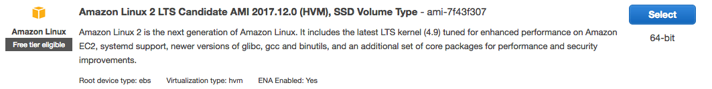
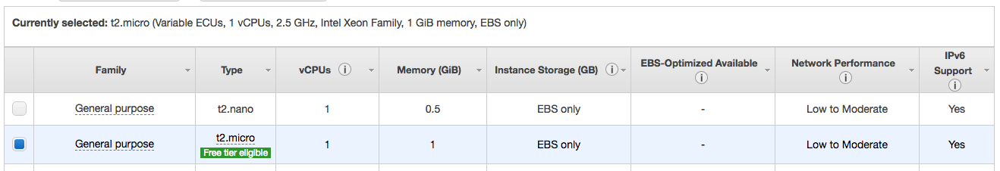
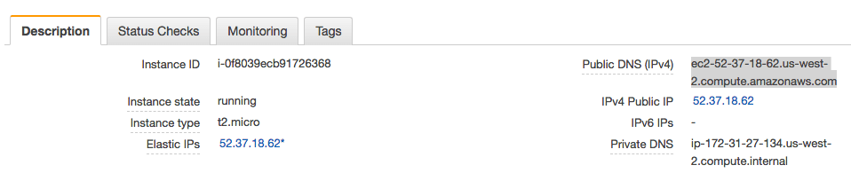

Amazon Web Services (AWS) is a popular choice for hosting web applications. As opposed to [DigitalOcean](../deploy2do/), AWS offers both low-level self-serviced infrastructure services as well as higher-level completely-managed platform services. In this tutorial, I will show you how to deploy Docker containers to AWS Elastic Compute Cloud (EC2) instances, which are Linux Virtual Machines (VMs) similar to DigitalOcean Droplets.

> *NOTE:* Creating EC2 instances can cost you money, but if you sign up for a new AWS account, or if you sign up for AWS Educate and get the credits applied to your account, the steps done in this tutorial won't cost you anything. If your account is older than one year, and if you don't have any AWS Educate credits, this will cost you some money. See [AWS EC2 Pricing](https://aws.amazon.com/ec2/pricing/) for details.

## Sign Up for AWS and AWS Educate

To get started with AWS, [sign up for a free account](https://aws.amazon.com/). For the first twelve months of your account, you will have free access to the services in their "free tier," which includes the low-power VMs we will create in this tutorial.

If you are a student, also sign up for [AWS Educate](https://aws.amazon.com/education/awseducate/). Once approved you will get AWS credits that you can renew each year.

## The EC2 Service

After you sign in to the AWS dashboard, you will see a list of all the services that AWS offers. The one you want is the EC2 service, which is under the Compute section.


Click on the EC2 link to go to the EC2 dashboard. Once there, click the *Launch Instance* button in the middle of the screen.


## AMIs

The next screen asks you to choose an Amazon Machine Image (AMI), which is a pre-configured virtual machine image. EC2 offers base images for all the various Linux Distributions, plus images that add commonly-used software to those distros. For this tutorial, we will use version 2 of Amazon's own Linux distro, commonly known as Amazon Linux 2.



## Size

The next screen asks you to choose an instance type, which determines how powerful your VM will be. Keep in mind that the more CPUs, memory, and network performance you choose, the more you will pay. For this tutorial, choose the "t2.micro" option, which is in AWS's "free tier" and is relatively inexpensive.



Make sure you've selected the "t2.micro" size and then click the *Review and Launch* button at the bottom of the screen.

## SSH Key Pair

The next screen shows you a confirmation page, and allows you to adjust a few of the default settings. For now, accept all the defaults and click the *Launch* button. This will bring up a dialog box you can use to select an existing SSH key pair, or create a new one.


An SSH key pair is an [asymmetric encryption key pair](../https/) that is used not only to authenticate you on this new VM, but also to encrypt all of the SSH communication between your development machine and this new VM.

If you don't already have a key pair registered with AWS, create a new one and download the new private key. The private key will be in a `.pem` file, which is a base64-encoded version of the key.

It's typical to move this downloaded private key to an `.ssh` directory just inside your home directory (`~/.ssh/`). That directory may not exist yet on your machine, but you can ensure that it does using this command:

```bash
mkdir -p ~/.ssh/
```

Copy the downloaded `.pem` file to that directory and then use this command to set the file permissions so that only your user account can read the file, and no one can modify it. Replace `name-of-key-file.pem` with the name of your private key PEM file.

```bash
chmod 400 ~/.ssh/name-of-key-file.pem
```

This key is like a password, so it should remain secret and accessible only by you. *Do not add private keys to your GitHub repos, and do not send them as email attachments*. They must be kept private. If your key is compromised, you should terminate any EC2 instances that use that key and generate a new key pair.

AWS will install the associated public key on your new EC2 instance so that you can connect to it using the private key you just downloaded. AWS will also hold on to the associated public key, and the next time you launch an EC2 instance, you can choose to use that same key pair.

## Launch!

After downloading the private key, launch your instance. This will create a new Amazon Linux 2 VM, and you should be able to see it starting up in your list of EC2 instances.

Once your instance is running and ready for an SSH connection, click on the instance in the list and find the *Public DNS (IPv4)* name for your new CM. It should be a sub-domain of `compute.amazonaws.com` (for example, `ec2-nn-nn-nn-nn.us-west-2.compute.amazonaws.com`. Copy this value to the clipboard.



return to your terminal and use this command to connect to your new VM, replacing `name-of-key-file.pem` with the name of your SSH private key file, and `your-public-dns` with the Public DNS name of your new VM.

```bash
ssh -i ~/.ssh/name-of-key-file.pem ec2-user@your-public-dns
```


