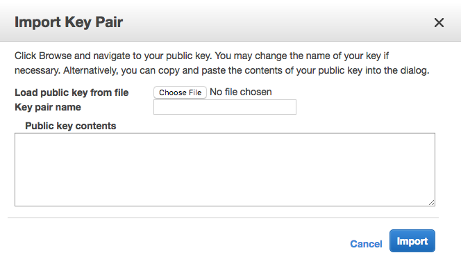

Amazon Web Services (AWS) is a popular choice for hosting web applications. As opposed to [DigitalOcean](../deploy2do/), AWS offers both low-level self-serviced infrastructure services as well as higher-level completely-managed platform services. In this tutorial, I will show you how to deploy Docker containers to AWS Elastic Compute Cloud (EC2) instances, which are Linux Virtual Machines (VMs) similar to DigitalOcean Droplets.

> *NOTE:* Creating EC2 instances can cost you money, but if you sign up for a new AWS account, or if you sign up for AWS Educate and get the credits applied to your account, the steps done in this tutorial won't cost you anything. If your account is older than one year, and if you don't have any AWS Educate credits, this will cost you some money. See [AWS EC2 Pricing](https://aws.amazon.com/ec2/pricing/) for details.

## Sign Up for AWS and AWS Educate

To get started with AWS, [sign up for a free account](https://aws.amazon.com/). For the first twelve months of your account, you will have free access to the services in their "free tier," which includes the low-power VMs we will create in this tutorial.

If you are a student, also sign up for [AWS Educate](https://aws.amazon.com/education/awseducate/). Once approved you will get AWS credits that you can renew each year.

## Generating and Registering SSH Keys

When you create a VM in any cloud infrastructure, you need a way to connect to it via `ssh` as a user with administrator privileges so that you can perform administrative tasks. SSH stands for "secure shell," and to be secure, it needs to authenticate you and encrypt communications between your development machine and the server. SSH can do that in one of two ways: you can supply the root user's password (not recommended); or you create and setup SSH keys (recommended).

SSH keys are private/public key pairs, similar to the ones used in [TLS](../https/). You can generate this key pair on your development machine, and add the public key to any new VM you create. When you connect, the `ssh` command uses your private key (which remains on your development machine only) to encrypt a message, and the droplet uses your public key to verify that message. Since you should be the only person in possession of your private key, it knows that you are you, and the authentication succeeds.

### Generate a Key Pair

To see if you already have an SSH key pair generated, use this command:

```bash
ls ~/.ssh
```

If you see files named `id_rsa` and `id_rsa.pub`, you already have a key pair and you can skip to the next section.

If you get a "no such file or directory" error, or if you don't see any files listed, you don't have a key pair generated yet. Use this command to generate one:

```bash
ssh-keygen -t rsa
```

By default, the new private key will be written to `~/.ssh/id_rsa` and the associated public key will be written to `~/.ssh/id_rsa.pub`. The `ssh-keygen` command will ask you if those file names are OK, and you can just hit return to accept the defaults.

You will also be prompted as to whether you want to add a passphrase to the private key. This is an added security measure you may want to use, but beware that you'll have to type this passphrase every time you use the key. Enter the passphrase, or just hit return to use no passphrase.

You'll see some output telling you where the new "identification" (private key) and public key files were saved. Now we need to register the public key with our DigitalOcean account.

## Register your Public Key with AWS EC2

Now you need to register your public key with the AWS EC2 service so that you can select it when launching new VMs. Sign into the AWS Management Console, and select the **EC2** service under the **Compute** section.


From the EC2 dashboard, select **Key Pairs** from the left navigation links, or at the top of the dashboard. The Key Paris screen allows to create a new key pair or import an existing key pair. Since we already have one, choose **Import Key Pair**.



Enter a name for the key that will help you remember which machine this key lives on. Then either load the public key from your `~/.ssh/id_rsa.pub` file, or paste the contents of that file into the **Public key contents** field. Finally, choose **Import** to import your public key.

When you create new VMs in the future, select this public key so that you can `ssh` into the VM using the corresponding private key, which is stored in the `~/.ssh/id_rsa` file on your dev machine.

## Launch an EC2 Instance

To launch a new VM, return to the EC2 dashboard, and choose the **Launch Instance** button in the middle of the screen.


## AMIs

The next screen asks you to choose an Amazon Machine Image (AMI), which is a pre-configured virtual machine image. EC2 offers base images for all the various Linux Distributions, plus images that add commonly-used software to those distros. For this tutorial, we will use version 2 of Amazon's own Linux distro, commonly known as Amazon Linux 2.


## Size

The next screen asks you to choose an instance type, which determines how powerful your VM will be. Keep in mind that the more CPUs, memory, and network performance you choose, the more you will pay. For this tutorial, choose the "t2.micro" option, which is in AWS's "free tier" and is relatively inexpensive.


Make sure you've selected the "t2.micro" size and then click the *Review and Launch* button at the bottom of the screen.

## SSH Key Pair

The next screen shows you a confirmation page, and allows you to adjust a few of the default settings. For now, accept all the defaults and click the *Launch* button. This will bring up a dialog box you can use to select an existing SSH key pair.


Select the key pair you registered earlier. AWS will install the public key from this pair on your new EC2 instance so that you can connect to it using the private key on your dev machine.

## Launch!

After selecting your key pair, launch your instance. This will create a new Amazon Linux 2 VM, and you should be able to see it starting up in your list of EC2 instances.

Once your instance is running and ready for an SSH connection, click on the instance in the list and find the **Public DNS (IPv4)** name for your new CM. It should be a sub-domain of `compute.amazonaws.com` (for example, `ec2-nn-nn-nn-nn.us-west-2.compute.amazonaws.com`. Copy this value to the clipboard.


return to your terminal and use this command to connect to your new VM, replacing `your-public-dns` with the Public DNS name of your new VM.

```bash
ssh ec2-user@your-public-dns
```

This connects to the VM using the user account `ec2-user`. This account has `sudo` permissions, so you will be able to install new software and do administrative tasks.


