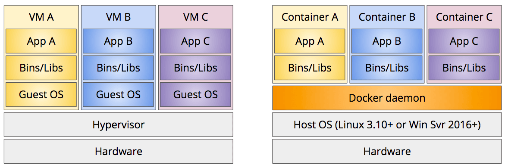
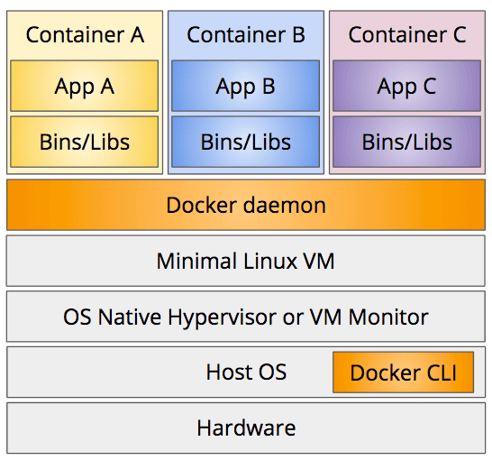

To deploy a web server, you need to get your application on to a computer that is connected to the Internet with a stable IP address. In the bad old days of the Web, this was done by renting rack space in a data center and installing your own gear. Since you were buying your own computers, you had to guess how much computing power, memory, and disk storage you might need. If you got it wrong, your computers would either sit idle most of the time, or struggle to keep up with the load. And even if you got it right, you had to buy enough equipment to handle your peak load, even if that occurred for only a few minutes each day.

Starting in the 2000s, several hosting companies developed more flexible alternatives based on **virtual machines (VMs)**. One physical machine could host several VMs, sharing its CPU, memory, storage, and I/O devices via a [hypervisor](https://en.wikipedia.org/wiki/Hypervisor). 

A virtual machine is like a computer running within another computer. To the developer, each VM feels like a real independent computer; it has a full copy of the operating system, application software, and any other supporting files your server needs. It's also isolated from the other VMs running on the same physical machine.

But since virtual machines are virtual and not physical, you can remotely spin-up a new VM within a minute or two, and spin it back down again when it is no longer needed. New VMs can be allocated to any physical machine, so hosting companies are able to more fully utilize their expensive hardware.

As desktop and laptop machines became more powerful, developers realized they could use this same technique to create consistent, isolated development environments on their own computers. Tools like [Vagrant](https://www.vagrantup.com/) made it easy for every developer on the team to spin-up the same Linux VM, with the same versions of the language compiler and database engine, regardless of which host OS they happened to use. VMs also made it easy to work on multiple projects that had conflicting dependencies, as the VMs provided separate isolated environments. For example, if one project required version 1 of some database engine, but another required version 2, you could easily switch between them by spinning down one VM and spinning up another. And since the developers were now working in the same environment as their target production servers, there were less unexpected failures when rolling out new versions to the Web.

This all worked well, but there were a lot of inefficiencies. VMs are quite heavy-weight: each VM includes a full copy of the entire operating system (OS), so the OS is duplicated in memory for each VM, even if all the VMs use the same OS. Spinning up a VM also requires a full operating system startup sequence, which can take a minute or two depending on how busy the physical CPU and I/O devices are.

During the 2000s, several features were added to the Linux kernel that provided similar levels of isolation for multiple _applications_ running on the _same operating system_. These features enable multiple isolated "containers" within a single OS, each of which has a separate file system, process group, and network stack, just like a VM. But unlike VMs, these containers share the underlying OS, so they have a much smaller memory footprint, and can start/stop almost instantly.

These new kernel features were complex and difficult to use, so in 2013 a new company named Docker released a set of command-line tools that made it far easier to build, run, and manage these containers. Docker became very popular, very quickly, and is now commonly used not only for deployment, but also for running any sort of server software on a development machine.

## What is Docker?

At its core, Docker is a technology for running application software in isolated, secure, and reusable containers. A container is like a VM, but much lighter-weight, as it can share the underlying operating system (OS), known as the **host OS**.



Docker containers are isolated from each other, as well as the host OS. Each container has its own independent file system, so it can't access the host's file system unless you explicitly allow it to do so (see the [Mounting Volumes](#secmountingvolumes) section below). Each container also has its own independent network address and stack by default, and only the ports you want accessible will be published to the host OS. The process groups are also separate and isolated so that a process in one container can't see or communicate with processes in other containers, or the host OS.

All of this isolation is good for not only handling conflicting dependencies, but also security. If a web application gets compromised, the attacker is trapped inside the container and can't do any real damage to the host OS or other containers. Any changes the attacker makes within a running container have no effect on other containers started from the same image. Those changes are also automatically erased when the current container is stopped and removed.

Docker consists of a set of command-line tools and a [daemon process](https://en.wikipedia.org/wiki/Daemon_(computing)) that runs on Linux (version 3.10 and beyond) or Windows Server (version 2016 and beyond). The tools just provide a command-line interface (CLI) to the daemon process, so all the real work happens in the daemon.

Since the daemon process requires Linux or Windows Server, using Docker on your Mac or Windows Professional development machine requires a Linux VM. In the early days of Docker you had to install this yourself, but now Docker's native applications for Mac and Windows come with a minimal Linux VM that runs on the native hypervisor built into MacOS and Windows Pro. The command line interface (CLI) still runs on the host operating system, but it communicates with the daemon process running within the Linux VM to do all the work.



## Container Images

In addition to leveraging the underlying operating system's containerization features, Docker also defines a standard format for container images. A **container image** encapsulates all the software and files your application needs to run into one easily-managed unit. A container image is like one of those [Meals Read to Eat](https://en.wikipedia.org/wiki/Meal,_Ready-to-Eat) that the military gives their troops: everything you need for a given meal, including the fuel to cook it, is all included in one easy-to-carry package.

Docker makes it easy to [build your own container images](#secbuildingcontainers) that include whatever executables, libraries, and files your application needs at runtime. Once built, you can run these images with one simple `docker run` command, and upload them to Docker's central registry known as [Docker Hub](https://hub.docker.com/).

Docker Hub is like GitHub, but for Docker container images instead of git repos (you'll probably notice a lot of similarities between the Docker and git commands—they purposely emulated git). Like GitHub, the free accounts give you unlimited public container images, but only one private container image. You can upgrade your account to get more private image storage.

Also like GitHub, anyone can download and run any public container image on Docker Hub. This makes it easy to not only deploy your own containers to the Web, but also run any of the popular open-source server software that is already on Docker Hub: relational databases engines like MySQL and PostgreSQL; no-SQL distributed data stores like redis, CouchDB, or Cassandra; message queues like RabbitMQ; or full Linux distros like Ubuntu or CentOS.

## Installing Docker

To build or run containers, you first need to install Docker on your machine. Like many open-source projects, Docker offers a free "community edition (CE)" as well as an expensive "enterprise edition (EE)" with more features. For this course, and for most open-source work, you only need the free community edition.

Mac and Windows users should install the Docker CE Desktop App for their respective platform:

- **Mac:** <https://store.docker.com/editions/community/docker-ce-desktop-mac>
- **Windows 10 Professional or Enterprise:** <https://store.docker.com/editions/community/docker-ce-desktop-windows>.
- **Windows 10 Home:** <https://www.docker.com/products/docker-toolbox>

These desktop apps install a minimal Linux VM for the Docker daemon process, and use your OSs native hypervisor to run it. You communicate with the daemon process using the command line tools, which run on your host OS, and can be used from your normal terminal application.

Note that Windows 10 **Home edition** doesn't include a native hypervisor, so you have to install the older Docker Toolbox on that platform. The Docker Toolbox installs an open-source, software-based virtual machine manager named [VirtualBox](https://www.virtualbox.org/wiki/Downloads) and uses that to run the minimal Linux VM for the Docker daemon process. The Docker Toolbox is already labeled as "legacy" so support for it may be discontinued in the near future.

## Running Containers

After installing and launching the Docker Desktop App, you can test it by running their "Hello, World!" container image. Use this command:

```bash
docker run hello-world
```

This command tells Docker to run and instance of the container image named `hello-world`, which is a container image the Docker developers already built and uploaded to Docker Hub. If you've never run this container image before, or if a newer version of the  image is available, the Docker daemon process will automatically download the image from Docker Hub before running it. 

After downloading the image, the Docker daemon process then runs a new **instance** of that container image. You can think of the container image as being like a Java class, while the container instance is like an instance of that class you create in memory. Each container instance is separate from all other instances, but all of them run the same code from the container image.

If all went well, you should see an output like this:

```
Hello from Docker!
This message shows that your installation appears to be working correctly.

To generate this message, Docker took the following steps:
 1. The Docker client contacted the Docker daemon.
 2. The Docker daemon pulled the "hello-world" image from the Docker Hub.
 3. The Docker daemon created a new container from that image which runs the
    executable that produces the output you are currently reading.
 4. The Docker daemon streamed that output to the Docker client, which sent it
    to your terminal.

To try something more ambitious, you can run an Ubuntu container with:
 $ docker run -it ubuntu bash

Share images, automate workflows, and more with a free Docker ID:
 https://cloud.docker.com/

For more examples and ideas, visit:
 https://docs.docker.com/engine/userguide/
```

The `hello-world` container image is just a simple executable that writes this message to the standard out stream. But you didn't have to build that executable, nor have any particular runtime environment installed on your machine to run it (e.g., Python or Node.js interpreter). Everything it needed to run was already inside the container image.

### Listing and Inspecting Containers

As soon as the executable finishes, Docker stops the container instance, but the log files and other information related to the container instance are still available. This is handy when something goes wrong, but it also consumes some disk space that you might want to recover.

To see a listing of all containers, including those that are stopped, use this command:

```bash
docker ps -a
```

The listing should show your stopped `hello-world` container instance, along with the container's unique identifier and automatically-generated name. Note that this automatically-generated name refers to this particular _container instance_ and not the _container image_ the instance is based upon. Since you can run multiple instances of the same container image, Docker assigns a unique name to the instance so that you can refer to it in subsequent commands.

Use either the container ID or the container name with this command to see what the container instance wrote to the standard out stream:

```bash
# for example, 
# docker logs 09f369706e7b
# docker logs gallant_snyder
docker logs <container ID or name>
```

By default, Docker captures all text written to the standard out stream into a log file that you can read later. This is very handy when containers encounter and error during startup. You can use this command to see the error and figure out what went wrong.

You can also see every setting Docker used while running the container using the `docker inspect` command:

```bash
docker inspect <container ID or name>
```

This produces quite a lot of output, so you often will want to pipe this through `grep`, or use the `--format` flag to specify a formatting template. See the [docker inspect](https://docs.docker.com/engine/reference/commandline/inspect/) documentation for details on this `--format` flag.

To clean up and delete all of this container information, use the `docker rm` command:

```bash
docker rm <container ID or name>
```

After running this command, all the log files and other information will be deleted, and if you run `docker ps -a` again, the resulting list should no longer show the `hello-world` container you ran earlier.

### Running Interactive Containers

The `hello-world` container is just an executable that runs and exits, but other container images give you access to an interactive shell within the running container. For example, if you've ever wanted to run an Ubuntu Linux VM on your development machine, you can do so quite easily with this command:

```bash
docker run -it --rm ubuntu
```

After downloading the image, Docker will run the container and put you into an interactive bash shell within it. You are now at an Ubuntu Linux command line, running as root. Use `ls` to list the files, and `whoami` to echo your user name. Type `exit` to exit the container's bash shell and return to your host OS shell.

We used two new flags when we ran that container:

- **-it** means you want an **i**nteractive **t**erminal inside the container. Since the default executable for the `ubuntu` image is `bash`, this connects your terminal to a new interactive bash shell within the container.
- **--rm** means that you want Docker to automatically remove the container when you exit. This is equivalent to immediately running `docker rm` after exiting the container, but avoid the need to figure out the container ID or name.

The `ubuntu` image includes only the core operating system, so many of the commonly-used Unix commands are not already installed. This image is designed to act as a base for your own container images, so it is purposely lean and mean. You can use the `apt` command to install other commands, but there is another container image that already has all the commands you probably need, plus a really cool name: BusyBox.

```bash
docker run -it --rm busybox
```

[BusyBox](https://busybox.net/about.html) is known as the "Swiss Army Knife of Embedded Linux." It's actually not a full Linux distro, but is instead one relatively small executable that can emulate a bash shell and most of the commonly-used Linux commands. It occupies about 1MB on disk, so it downloads very quickly, and is small enough to be used in many kids of embedded systems.

After stating a BusyBox container, try using the the `nc` command as described in the [HTTP tutorial](../http/#secletstryit). To see a full list of commands supported, execute the `busybox` command.

### Running Detached Containers

Docker can also run containers that are meant to continue running in the background, such as web servers and database servers. These are known as **detached containers** because your host OS terminal is not attached to the process running within the container. Once these containers are started, your terminal returns to your host OS prompt, but the container keeps running in the background, ready to process requests. To run a detached container, we add the `-d` flag to the `docker run` command.

Since these sort of containers commonly respond to network requests, and since Docker containers are completely isolated from the host network by default, we also need to explicitly tell Docker to publish ports from the container to the host OS. This makes it possible to send a network request into the container from the host OS and receive a response. This publishing of ports is done using the `-p` flag on the `docker run` command. 

For example, to run the popular [NGINX web server](http://nginx.org/) as a detached container, and publish port 80 in the container to port 80 on the host, use this command:

```bash
docker run -d -p 80:80 --name mynginx nginx
```

You can publish multiple ports by including multiple `-p` flags. For example, to publish ports 80 and 443, use `-p 80:80 -p 443:443`. If you don't publish any ports, the container won't be reachable from the host OS, nor any client that communicates with the host OS.

Here we also added the `--name mynginx` flag, which assigns a particular name to the container instance instead of letting Docker generate a random one. This will make it easier for us to stop and remove the container later.

The `docker run` command will respond by printing just the new container ID (long form) and then return you to your host OS prompt. But the container is still running. To verify this, run the `docker ps` command

```bash
docker ps
```

You should see your `mynginx` container in the list.

Since we published port 80 within the container to port 80 on the host, you can also request the web server's home page by clicking this link: <http://localhost>. Your web browser will make an HTTP request to port 80 on your Host OS, Docker will forward that into the container, and the NGINX web server inside the container will process the request by returning its default home page.

To stop and remove the container use the `docker stop` and `docker rm` commands:

```bash
docker stop mynginx
docker rm mynginx
```

Since these commands are often invoked together, Docker also provides a handy shortcut that does both. Just include the `-f` flag when running `docker rm` to force the container to stop before removing it:

```bash
docker rm -f mynginx
```

### Mounting Volumes

By default, a Docker container has a completely separate and isolated file system from the host. The container can't read the host files, nor modify them. But there are times when you do want a container to at least read files on the host. For example, say you want to run the NGINX web server container, but let it read the web client files you are working on in the current directory as the default web site. To enable this, you can use the `-v` flag to mount a directory from the host OS as a new volume within the container's file system. For example:

```bash
docker run -d \
-p 80:80 \
--name mynginx \
-v /Users/dave/mywebsite:/usr/share/nginx/html:ro \
nginx
```

Since the number of flags is now getting large, I've switched to using a multi-line bash command. If you end a line with `\`, bash will treat the next line a continuation of the same command. But be careful not to include a space after the `\`. That will be interpreted as the end of the command, and the `\` will be treated as a command argument. The line must end with the `\` character in order for the continuation to work.

As before, we use the `-d` flag to run the container detached, `-p` to publish port 80, and `--name` to provide a specific container name. But we add a `-v` flag, whose value should be in this form:

```
-v /host/file/path:/container/file/path:ro
```

The first part of the value is the absolute path of the directory on your host that you want to expose inside the container. The second part (after the `:`) is the path inside the container's file system where you want that directory tree to appear. The `:ro` on the end stands for "read-only." Using this ensures that code running inside the container can't make changes to the files on the host.

For example, the value `/Users/dave/mywebsite:/usr/share/nginx/html:ro` will make the host directory `/Users/dave/mywebsite` available inside the container at the path `/usr/share/nginx/html`. So the host file `/Users/dave/mywebsite/index.html` will appear inside the container at `/usr/share/nginx/html/index.html`. That is the path where NGINX looks for the site's home page.

When you mount a volume, the path inside the container can be an existing path or a new one. If it's an existing path, Docker effectively replaces the files that were already in the container at that path with the files from your mounted directory.

As you change the files on your host, Docker also ensures that the files inside the container are updated accordingly. Thus you can work on your web site files in your favorite graphical editor on the host, and your saved changes will be visible immediately to the NGINX server running inside the container.

Just as with port publishing, you can mount multiple volumes by specifying multiple `-v` flags.

The host path must be an absolute path, but if you're on a Mac or Unix system, or if you are running the Windows 10 bash subsystem, you can use a neat bash completion trick to refer to the current directory. The `pwd` command will return an absolute path for the current directory, and the syntax `$(pwd)` will expand to be the result of the `pwd` command. So to mount the current directory into the container at `/usr/share/nginx/html` you can change the `-v` flag to be like this:

```bash
# mount current directory into container
-v $(pwd):/usr/share/nginx/html:ro
```


## Building Containers


## A Docker Clean Up Script


