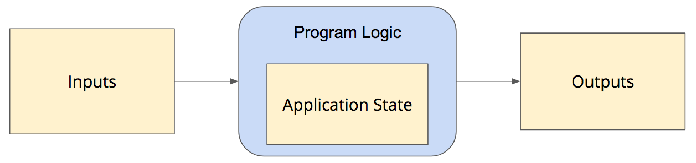

[HTML](../html), [CSS](../css), [JavaScript](../javascript), and [the Document Object Model](../dom) give us everything we need to build just about any web application we could imagine. But if you sit down and try to build something complex like a browser-based game, you will quickly realize that you are still missing something important: how to structure such an interactive application so that it's easy to implement, reason about, and extend. That is to say, you need to learn how we architect complex interactive applications, and how that architecture is typically represented in JavaScript.

## Simple Application Architecture

Most of the programs you wrote in your introductory computer science courses were non-interactive. These sorts of programs start with an initial state, which are the values of all the variables in the outer-most scope, and perhaps some input data that are provided as command-line arguments. The program then executes a series of logic operations on those data, and generates some sort of output before exiting.

Once the program starts, the initial state is combined with any provided inputs to form the current **application state**. An application's current state consists of all variables and parameter values that are currently in-scope. The program's logic interacts with this application state, reading from it and modifying it, as it goes along. At various points in the execution, the program generates outputs that typically depend on its current state.

But once a simple program like this begins to execute, it doesn't accept any further input from the user. The program executes all of its instructions from beginning to end and then exits. It doesn't respond to keystrokes or mouse clicks while executing, so all state transformations are the result of the program's own internal logic.

## Interactive Event-Driven Application Architecture

Interactive applications extend this simple application architecture by responding to user interactions while the program is running. For example, a command-line program might prompt the user to enter a value, such as the user's name or the number of a menu item, and then respond accordingly. These programs still start with and manage a current application state, but the user can now modify that state via their interactions. For example, the user's current name is part of the application state, but starts out as an empty string. Once the user enters a name, the program updates the application state to match what the user entered, and then refers to that state value while executing the rest of the program.

Interactive programs that simply ask for a value and continue processing are typically written in a **blocking** style: the program calls a runtime library function to get input from the user, and that function blocks (pauses execution) until the user inputs the value. The function then continues execution of the program, returning the value it received from the user.

But more complex interactive applications, especially those that run on desktop GUI systems or web browsers, are written in an **event-driven** style. When these kinds of applications start, they do some initial processing that includes registering functions that should be called when various user interactions occur. For example, the program might declare a function called `onNewGameClick()` and then [ask the browser to call that function whenever the user clicks a particular button](../dom/#seclisteningforevents). 

The event-driven programming style makes it easier to handle multiple of these interactions throughout the course of the application. Whenever a particular interaction occurs (touchscreen tap, mouse click, key press, etc.), the browser calls the appropriate function, which modifies your application state. At any moment, your program can read that state to know exactly what's going on and what it should do next.

## The Model-View-Controller Architecture

### Models

### Views

### Controllers

