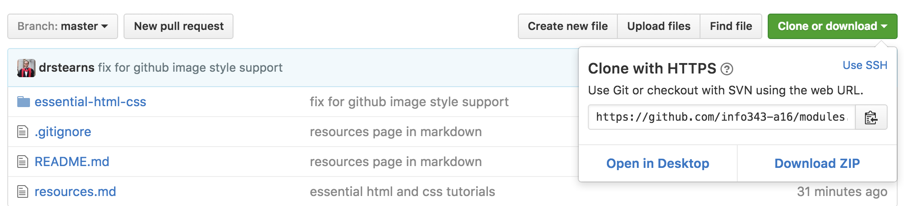

One thing you will quickly discover is that a typical web site involves _a ton_ of files. Every HTML page, every CSS stylesheet, every module of JavaScript, and every multimedia asset is a separate file, organized into a folder hierarchy. Even simple sites will typically have a dozen or more files, and large complex sites often involve hundreds.

Managing changes to these files by hand can become complex and error prone, especially when a whole team is working on the files at the same time. Moving the files from your local development machine to your web server can also be difficult to manage, especially when you're unsure which files you've modified since you last published the site.

Thankfully, there are a class of tools that are designed to make managing all these files much easier. They are called **version control systems**, and the most popular of these in the open-source community is known as [git](http://git-scm.com/). Although git can be used without a central server, it is commonly paired with the collaborative, cloud-based repository service [GitHub](https://github.com/), which maintains a copy of your files in a central, secure, and backed-up location.

The git command line tools are already installed on the iSchool lab machines, but you can also [install them on your own computer](http://git-scm.com/downloads) for free. We will use git throughout this course, so if you plan to use your own machine at some point, you should just install them now. If you are afraid of the command line, you can also install the GitHub graphical tool ([Mac](https://mac.github.com/) or [Windows](https://windows.github.com/)), though all examples in this tutorial will use the command line.

## What is Git?

Git is a system that can store, retrieve, and merge various versions of your files. It's kind of like Dropbox and Google Docs, but with two big differences:

1. New versions of your files must be explicitly committed when they are ready. Git doesn't save a new version every time you save a file to disk. That approach works fine for word-processing documents, but not for programming files. You typically need to write some code, save it, load it in your browser, test it, debug, make some fixes, and test again before you're ready to commit a new version.
1. For text files (which nearly all your web development files will be), git pays attention to changes at the line level, and not just the file level. That means it can automatically merge together different changes made to different parts of the same file.

Like Dropbox and Google Docs, git can show you all previous versions of a file and can quickly rollback to one of those previous versions. This is often helpful in web development, especially if you embark on making a massive set of changes, only to discover part way through that those changes were a bad idea (I speak from experience here &#x1F631; ).

But where git really comes in handy is in team development. Almost all professional web development work is done in teams, which involves multiple people working on the same set of files at the same time. Git helps the team coordinate all these changes, and provides a record so that anyone can see how a given file ended up the way it did.

### Git Core Concepts

To understand how git works, you need to understand its core concepts. Read this section carefully, and come back to it if you forget what these terms mean.

- **repository (repo):** An archive containing all the committed versions of all your files, along with some additional meta-data, stored in a hidden subdirectory named `.git` within your project directory. If you want to sound cool and in-the-know, call this a "repo."
- **commit:** A set of file versions that have been added to the repository, along with the name of the person who did the commit, a message describing the commit, and a timestamp. This extra tracking information allows you to see when, why, and by whom changes were made to a given file.
- **staging area:** A set of new changes that are ready to be committed to the repository. All changes to all files in the staging area will be included in the next commit, but not changes made to other files. Git doesn't automatically add new files to the staging area, nor does it add new versions of existing files. Instead, you tell git explicitly which files you want to include in the next commit via the `git add` command. This allows you to commit some changes while leaving others for a latter commit.
- **branch:** All git repositories start with one branch named `master`, but you can create other branches if you wish. Changes committed to one branch are kept separate from those committed to other branches, allowing you to work on new features or crazy ideas, but still quickly switch back to the main `master` branch to make bug fixes. Once a feature is complete, you can merge committed changes from the new feature branch into the `master` branch with one quick command.
- **remote:** A link to a copy of this same repository on a different machine. Typically this will be a central version of the repository that all local copies on your various development machines point to. You can push commits to, and pull commits from, a remote repository to keep everything in sync. You can also add more than one remote link if you are working with multiple remote repositories.
- **merge conflict:** A condition that occurs when you merge commits pulled from another branch or repository that include changes to the same lines that you've already changed locally. In this case, git doesn't know which version is correct, so you must resolve the conflict by choosing a winner, or manually combining the changes.
- **.gitignore file:** A file in your project's root directory that contains file paths that git should ignore. This is very useful for keeping things out of the repository that should never be in there, such as current workspace settings saved by an Integrated Development Environment (IDE), or files containing login information or secret keys.

### Git Core Commands

Git offers many commands, but there is a small core set that you will use most of the time.

- `git clone <repository-url>`: Creates a new copy of a source repository, which typically exists on a remote server. Use this when you want to clone down a GitHub repository. This command will create a new subdirectory with the same name as the source repository.
- `git init`: Creates a new repository in the current directory that is not yet associated with any remote repository. Use this when you just want to use git locally without an associated remote GitHub repository. You can add a link to a remote repository later if you wish.
- `git status`: Tells you the current status of the git repository. It also tells you the commands to execute next. If you are in doubt, execute `git status` and read what it says.
- `git add`: Adds a file or files to the staging area. All changes to those files will be included in the next commit.
- `git commit`: Commits all changes to all files currently in the staging area to the repository.
- `git push`: Pushes all commits made since the last push to another remote repository, typically to a service like GitHub.
- `git pull`: Pulls all commits made since the last pull from another repository, and attempts to merge those changes into your current files. If the pulled commits involve changes to the same lines that you've already changed locally, this process will produce a **merge conflict** that you will have to resolve by editing the file.

Also check out this handy [Cheat Sheet](https://services.github.com/kit/downloads/github-git-cheat-sheet.pdf), as well as documentation on [the complete set of git commands](https://git-scm.com/docs).

## What is GitHub?

Git was made to support completely decentralized development, where developers pull commits from each other's machines directly. But most professional teams take the approach of creating one central repository on a server that all developers push to and pull from. This repository contains the authoritative version the source code, and all deployments to a web server are done by cloning/pulling from this centralized repository.


Teams can setup their own servers to host these centralized repositories, but many choose to use a server maintained by another service provider. The most popular of these in the open-source world is [GitHub](https://github.com/). In addition to hosting centralized repositories, GitHub also offers other team development features, such as issue tracking, wiki pages, and notifications. Public repositories on GitHub are free, but you have to pay for private ones. Students can sign up for their [Student Developer Pack](https://education.github.com/pack), which gives you free repos and other discounts while you are student.

## Creating and Cloning a Repository

To help you get comfortable with using git, let's create a test repository on GitHub, clone it to your local machine, make some changes, and push those back up to GitHub.

Start by [creating a new repo on GitHub](https://help.github.com/articles/create-a-repo/). Since this is just a test, you can name it whatever you want, keep it public, and check the box to says you want a README file so that your new repo will contain at least one file. 

This creates the repository on GitHub, but to work with it, you need to **clone** that repository to your local machine. Cloning creates a copy of the repository on your machine, but also records where the copy came from, so that you can easily push changes back to the **origin** repository.

To clone a repo, first go to the repo's home page on GitHub, and copy the HTTPS clone URL to your clipboard. You can find the HTTPS clone URL here:

<p></p>

Clicking the clipboard icon to the right of that box will copy it directly to your clipboard.

> These next steps are done at the command line. If you've never used the command line before, check out the written tutorial [Introduction to the Mac OS X Command Line](http://blog.teamtreehouse.com/introduction-to-the-mac-os-x-command-line) or the video [Introduction to the Terminal in Mac OS X](https://www.youtube.com/watch?v=yIY3iPDVUBg). If you're on Windows, check out this video on [Git Bash for Windows](https://www.youtube.com/watch?v=bqV-eszlRhY).

If you're on a Mac, open the Terminal application; if you're on Windows, open the Git Bash command window, or the new [subsystem for Linux](https://msdn.microsoft.com/en-us/commandline/wsl/about). This will probably start you in your home directory. To see where you are, use this command:

```bash
pwd
```

It's good practice to keep all your code under a subdirectory of your home directory, so if you haven't done so already, execute these commands to create a new subdirectory named `code` and change into it.

```bash
mkdir code
cd code
```

The `mkdir` or "make directory" command creates a new subdirectory within the current directory, and the name of that new subdirectory follows the command (in this case `code`). The `cd` or "change directory" command changes the current directory to whatever path follows the command. In this case we changed into the new subdirectory we created during the previous command.

> Feel free to organize your files differently if you want to. I don't care how you organize your local files, but it's good practice to keep your code separate from your other documents.

Now clone your repository to your machine using this command (replacing _your-clone-url_ with the URL you just copied):

```bash
git clone your-clone-url
```

This will create a new directory within your `code` directory, with the same name as your repository. To change into that new directory, use that `cd` command again, replacing _name-of-your-repo_ with the name of your GitHub repository:

```bash
cd name-of-your-repo
```

To see all the files in this directory, use the `ls` (list) command:

```bash
ls
```

And you can see the status of this repository by executing this command:

```bash
git status
```

It should report that the working directory is clean and there is nothing to commit.

## Configure Git User Information and Editor

If you are on a lab machine, or if you just installed git and haven't configured it yet, you now need to tell git who you are so that you can add and commit changes to a repository. **You only need to do this once on your own machine**, but since our lab machines reset each time you logout, you must do this each time on a lab machine.

Enter these commands in your terminal/command window, replacing _your full name_ with your full name and _your-email-address_ with the email address you used when you signed up for GitHub:

```bash
git config --global user.name "your full name"
git config --global user.email your-email-address
```

If you're doing this on an iSchool lab machine, don't worry—this personal information will be erased when you log out and reboot the lab machine.

## Add a .gitignore File

Sometimes you want git to ignore particular directories or files in your project. For example, if you use a Mac and you customize the way files are shown in the Finder, the Mac will create a hidden file in that folder named `.DS_Store` to track the view settings. You don't want to add a file like that to your git repository, as it will likely differ from machine to machine and it's not relevant to your code. If you add this sort of file, and you work on your code from multiple machines (or work in a team) you will end up with lots of merge conflicts.

You can tell git to ignore files like this by creating a special file in your project directory named `.gitignore`. If git sees a file with this name in your project directory, it will ignore directories or files that are listed in the file. The file uses a very simple format: each line should contain a directory or file path to ignore. For example:

```
.DS_Store
node_modules
npm-debug.log
```

You can create a `.gitignore` file using your text editor, but it's even easier to create it via the command line. Use this command from within your project's root directory:

```bash
echo ".DS_Store" >> .gitignore
```

This command will create the file `.gitignore` if it doesn't already exist, and then append the text `.DS_Store` as a new line at the end of the file. This tells git to ignore a file named `.DS_Store` if one exists inside any directory within your project. You can verify that this worked by executing this command:

```bash
cat .gitignore
```

This prints the contents of the `.gitignore` file, which should have the one line containing the text `.DS_Store`.

It's a good idea to create a `.gitignore` file for every repository, and include at least the file paths shown above. It's also useful for excluding files containing secret keys or user credentials.

## Add and Commit Changes

You've now added a new file. To see all the files that have changed, execute this command and **read the output**:

```bash
git status
```

It should show you which files are not yet being tracked, and which have been modified. It should also give you a clue as to which commands you need to execute next.

You can add the files one at a time, but you can also add all the files to the staging area at once with this command:

```bash
git add .
```

The `.` character refers to the current directory, so this command tells git to add all new and modified files in this directory and below to the staging area.

Now commit these changes using this command:

```bash
git commit -m "added gitignore file"
```

If you omit the `-m "message"` part of the command, git will put you into a command-line text editor so that you can compose a message. By default this will be `vim`, which is an powerful but not terribly approachable tool. Hit the `i` key to start typing a commit message. When you're done, hit `Esc` to get back to command mode, and then type `:wq` followed by `Enter` to save and exit.

Your changes are now committed to the repository. To verify this run `git status` again and it should say that you have nothing to commit.

## Push Changes to GitHub

The previous step recorded a set of changes to your local repository on your local machine, but in order for others to see those changes, and to ensure that they are backed up, you now need to push them up to GitHub.

Git already knows where this repository originally came from, so to push your changes back to it, enter this command:

```bash
git push
```

This will push all commits made since the last push to your GitHub repository. After pushing these changes, go back to your repository on GitHub, refresh the web page, and you should see all the new files, along with your commit message. If you click on the message, GitHub will show you exactly which lines changed and how.

## Lather, Rinse, Repeat

Now that you know how to add, commit, and push, try going through the cycle a few more times. If you need inspiration, do something like this:

- Create a simple [HTML file](../html/) named `index.html` in the repository directory.
- Add it to the staging area.
- Commit the new file to your local repository.
- Push the changes to GitHub and verify that the new HTML file is there.
- Now modify the HTML file.
- Add the modified file to the staging area.
- Commit the modification to your local repository.
- Push the the change to GitHub.


>**Pro Tip:** you can add and commit in one step if the file was previously added to the repository. Use the -a flag as well as -m when you execute git commit:

```bash
git commit -a -m "my commit message"
```

Git also allows you to combine those two flags in an even shorter syntax:

```bash
git commit -am "my commit message"
```

Note that **this doesn't work for new files** that have never been added to the repo. Those must still be added using `git add`.

## Make a Mistake and Revert

Version control systems also make it easy to recover from a mistake. For example, open your HTML file, change it in a bad way, and save it. Then execute these commands to undo those changes and get back to the way it was when you last committed it to your repository:

```bash
git checkout -- index.html
```

This will revert the file to the way it was the last time you committed it to your repository.

But what if you committed something bad and needed to revert it to some previous version? You can do that as well. Make some bad changes, but this time add them to the staging area and commit them to your local repository. Then run this command to revert that commit:

```bash
git revert --no-edit HEAD
```

The `--no-edit` option tells git to use the default revert message instead of prompting you for one, and `HEAD` tells git to revert the most recent commit, which is pointed to by the `HEAD` reference variable.

Interestingly, this doesn't actually remove your previous commit from the repository's commit history. Instead, it creates a new commit that undoes whatever changes were done in the previous commit. From an archival point of view, this is great—we never lose the historical record of what has been done in the repository, and we can always go back and see exactly what was changed, when it was changed, and by whom it was changed.

## Create a Branch

So far, all your changes have been on the default `master` branch within your repository, but git allows us to create multiple **branches** within the same repository. Multiple branches allow us to work on new features, making commits along the way, without disrupting our master branch until the feature is done and tested. The commits made to different branches are kept separate from each other, and git makes it very quick and easy to switch between branches. Once the work on a branch is complete, git allows us to **merge** the commits made to one branch into another.

Git doesn't prescribe any particular way to use branches, but a very common workflow you will encounter in the industry is referred to as [git flow](http://nvie.com/posts/a-successful-git-branching-model/). The basic recipe goes like this:


- The dev lead creates a `develop` branch off of `master` that reflects the current in-development version of the code. This branch contains features that are completed and tested, but haven't yet been officially released. If your software needs to be compiled (Java, C#, C++, Go, etc.), the official daily (unstable) build is made from this branch.
- Each developer then creates a new branch off of `develop` for each new feature or set of related features. Code in these branches can be incomplete and unstable, and is largely private to the developer or developers working on those features. These are often referred to as "topic branches" or "feature branches."
- Once the feature is complete and tested, the feature developer creates a **pull request** on GitHub, asking to merge all commits from the feature branch into the `develop` branch. The changes are reviewed by the dev lead or a committee, and if approved, the commits are then merged into the `develop` branch. Other developers can then pull those commits into their own local repos using the `git pull` command.
- When all features for a given release are ready, the dev lead will create a `release` branch off of `develop`. Developers can then resume working on new features for the next release, and new commits can be merged into `develop` without disrupting the `release` branch. Release candidate (RC) builds are made from the `release` branch. If any last-minute bugs are found in the release candidate code, fixes are made to the `release` branch and then merged back into `develop` if appropriate.
- When the official release is ready, the dev lead merges all commits from `release` into `master` and adds a **tag** to indicate the version number.

In this course, most of your work will be done individually, so the full implementation of git flow is probably a bit overkill. But using a separate topic branch for new feature work is still a good idea, so let's practice that now.

In your repository directory, execute this command to create a new `feature-1` branch off of `master` and switch to it:

```bash
git checkout -b feature-1
```

To verify that you are on the `feature-1` branch, execute `git status` and ensure that it says `On branch feature-1`. You can also execute `git branch` to see all branches with the current one prefixed with a star (and highlighted in green on most systems).

Now make some changes to your `index.html` file, add those changes to the staging area, and commit them. Do something obvious so that it's easy to see when the change is there and not there. Ensure that all your changes are committed using `git status`.

Switch back to the `master` branch using this command:

```bash
git checkout master
```

Look at your `index.html` file again and notice that the change you made is now gone. But don't worry—it's still there, but it's on the `feature-1` branch, not the `master` branch. Switch back to the `feature-1` branch using this command, and notice that your change returns:

```bash
git checkout feature-1
```

> **NOTE:** some editors (like Sublime Text) may not automatically refresh to show changes to the underlying file until you activate the window. If you don't see the file change in your editor as you checkout the various branches, try activating the editor window by clicking on it.

To merge the changes you committed to `feature-1` into `master`, use these commands:

```bash
git checkout master
git merge --no-ff feature-1
```

Unless there's a conflict, git should just merge all the commits made to `feature-1` into `master` without any errors, and your `master` branch should now contain the changes you made over in the `feature-1` branch.

> **NOTE:** The `--no-ff` flag above forces git to explicitly record the merge from `feature-1` into `master`, as opposed to simply applying the commits you made in the `feature-1` branch to `master` with no record of the merge. Since we didn't make any new commits to `master` since we created the `feature-1` branch off of it, git could merge the commits you made to `feature-1` by simply replaying them on top of the `master` branch, an operation known as a "fast-forward" merge. This makes it look like all of the `feature-1` commits were made directly to `master`, which obviously hides what really happened. For a graphical explanation see Atlassian's [git merge](https://www.atlassian.com/git/tutorials/git-merge) tutorial. Some developers prefer the cleaner history of a fast-forward merge, while others prefer the more accurate history recorded by a non-fast-forward merge. Your development lead will likely dictate which approach you must use for a project.

To see a complete log of what you've done, use this command:

```bash
git log --graph
```

The `--graph` flag adds a little ASCII art to the log output, showing you the branching and merging. Note that if you don't include the `--no-ff` flag, it will appear as if all the commits made to `feature-1` were actually made directly on `master` (see note above).

## GitHub Pull Requests

Although git lets you merge commits from one branch to another, most professional teams use a **pull request** when merging feature work into the `master` branch. A pull request facilitates a process called **code review**, where other developers review your changes, make comments, and ask you to correct anything they find problematic. Once your changes are approved, the reviewers will then merge your commits into the target branch.

GitHub makes this process fairly easy through their [pull request feature](https://help.github.com/articles/creating-a-pull-request/). Try using it by following these steps:

- Make sure you are on the `master` branch (`git checkout master`)
- Create another new branch off of `master` named `feature-2` (`git checkout -b feature-2`).
- Make another change to your `index.html` file, add it to the staging area, and commit it.
- Push your new branch with the new commit to GitHub using this slightly different command:

```bash
git push --set-upstream origin feature-2
```

The `--set-upstream` flag tells git to create a new branch on your GitHub repo (the `origin`) named `feature-2` and push all commits from the current local branch to it. 

- Navigate to your repository on GitHub's web site, and choose the **New Pull Request** button. 
- Choose `master` as the base branch, and `feature-2` as the compare branch. GitHub should automatically determine the set of commits to merge and let you know that the branches can be automatically merged.
- Choose the **Create pull request** button to finish creating the pull request.

After you create the pull request, you can click on the **Files Changed** tab to see all the changes made to all files since the last merge. You can click on any line to add comments.

Normally you would let those reviewing your pull request perform the actual merge once they've approved your changes, but for this tutorial, you can pretend you are your own reviewer. To merge the commits into the `master` branch, go back to the **Conversation** tab and choose the **Merge pull request** button.

Note that when you merge a pull request via the GitHub web site, the merge is done entirely on the server. Your local development clone will not yet have those changes in your local `master` branch. To get those changes from the server, switch to the `master` branch and use a `git pull` command:

```bash
git checkout master
git pull
```

This will pull all new commits made to the `master` branch on the server and merge them into your local repo's `master` branch.

If there are multiple developers working on your repo, or if you work on the same repo from multiple machines (e.g., laptop, desktop, lab), it's a good idea to start each work session by executing `git pull` to pull any new commits made by others or by yourself on another machine. If there are new commits, git won't let you push until you've pulled them. This command never hurts: if there's nothing new, it just tells you so and exits.

## Publish to GitHub Pages

So far you've been creating a simple web page and making changes to it, but that page is not yet something a user could navigate to in a web browser. That is, it's not published on a publicly-accessible web server. We need to **host** that page on a web server that anyone in the world can access.

There are many options for web hosting, but one of the easiest is to use [GitHub Pages](https://help.github.com/articles/what-is-github-pages/). You can make the files in your repository accessible on the web simply by merging your commits into a new branch with a magic name: `gh-pages`.

Create a new branch named `gh-pages` off of your `master` branch, and push the new branch to GitHub:

```bash
git checkout master
git checkout -b gh-pages
git push --set-upstream origin gh-pages
```

After the push completes, you should then be able to see your web page using the following URL, replacing _your-github-username_ with your GitHub user name, and _your-repo-name_ with your repository name:

```
https://your-github-username.github.io/your-repo-name
```

Note three important things about all of this:

- The `gh-pages` branch must be named exactly that. If you misspell the name, or use an underscore instead of a dash, it won't work.
- Only the files and commits in the `gh-pages` branch are visible on the web. All commits in other branches (`feature-2`, `master`, etc.) are not visible on the web. This allows you to work on your site with others before publishing those changes to the web.
- Any content in the `gh-pages` branch will be publicly accessible, even if your repo is private. You can remove specific files from the `gh-pages` branch that you don't want visible on the web, while still keeping them in the `master` branch: use the `git rm` to remove the file and then add, commit, and push the deletion.

## Keep Learning

This tutorial gets you started with git, but there is a lot more to learn. Keep learning by reading the free online book [_Pro Git_](https://git-scm.com/book/en/v2) by Scott Chacon and Ben Straub. Or check out the very approachable and affordable book [_Git for Humans_](https://abookapart.com/products/git-for-humans) by David Demaree.
