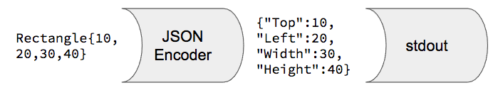

One of the key scenarios for the Go language was [building web servers](../goweb/), and since data on the web is typically transmitted in the [JSON format](http://www.json.org/), Go has excellent [support for JSON](https://golang.org/pkg/encoding/json). It's very easy to encode a Go [struct](../golang/#secstructs) into JSON, or decode JSON into a struct. Go also provides us some control over how that encoding/decoding occurs.

## Encoding

If you have an instance of a struct, you can encode it into JSON like so:

```go
package main

import (
	"encoding/json" //JSON package from the standard library
	"fmt"
	"os"
)

//Rectangle represents a rectangle shape
type Rectangle struct {
	Top    int
	Left   int
	Width  int
	Height int
}

func main() {
	//create an instance of a Rectangle
	r := Rectangle{10, 20, 30, 40}

	//create a new JSON encoder over stdout
	//and encode the struct into JSON
	enc := json.NewEncoder(os.Stdout)
	if err := enc.Encode(r); err != nil {
		fmt.Printf("error encoding struct into JSON: %v\n", err)
	}
}
```
<a href="https://play.golang.org/p/Esk_nrSyZ3" class="button is-primary">Run in the Go Playground</a>

The `json.NewEncoder()` function creates a new `json.Encoder` object, which can write JSON-encoded data to the stream supplied as the first parameter. Here we pass `os.Stdout`, which is the [standard output stream](https://en.wikipedia.org/wiki/Standard_streams) from the operating system shell. This creates a data transformation pipeline that looks conceptually like this:



The output stream can be any writable stream. Here we use standard out, but in a [web server](../goweb/) we will use the HTTP response stream to write encoded JSON back to the client.

The `.Encode()` method of the encoder does the actually JSON and encoding and writing to the target stream. It will return an error if the data you are trying to encode can't be translated into legal JSON. For example, there are several values in Go that can't be represented in JSON: an infinite number, or the not-a-number (NaN) value. Go [maps](../goslicemap/#secmaps) are automatically converted into JSON objects, but Go allows you to use data types for keys other than `string`, while JSON only supports strings for object keys.

The encoder will handle all sorts of data types, including maps, slices, and pointers to other structs. Be careful about circular references: the Go garbage collector can handle two struct instances that point to each other, but the JSON encoder will chase those pointers infinitely and hang your program!

The error checking code above also demonstrates a neat trick in Go that isn't common in other languages: the `if` statement can have an initializer expression, similar to the first expression in the `for` statement. The expression before the `;` is executed and then the condition after the `;` is evaluated to determine if the code inside the `if` block should be executed. This use an initializer for error checking is a common idiom in Go programming.

## Fields Must be Exported to be Encoded

One thing that trips up most people who are new to Go is that the JSON encoder can only see, and therefore only encode, exported fields in a struct. Recall that Go uses the package boundary as its primary mechanism for encapsulation, and that [only the identifiers that start with a capital letter are exported](../golang/#secpackagesandcodeorganization). Since the JSON encoder is defined in the `json` package and not your `main` package, it can only see the fields in your struct that are exported from your package. Therefore, if you want a field encoded into JSON, it must be exported, so it must start with a capital letter.

When I first started learning Go, I spent several hours trying to figure out why a struct like this was being encoded into an empty JSON object:

```go
type Rectangle struct {
	top    int
	left   int
	width  int
	height int
}
```

See the difference? The fields are all lower-case, and therefore are not exported from the `main` package. You can pass this struct to the JSON encoder, but [the result will always be an empty JSON object](https://play.golang.org/p/cp21hp1k7g) because the code in the `json` package can't see those fields.

This is an easy trap to fall into because the `.Encode()` method **won't return any sort of error**. On the one hand this makes sense: unexported fields are private to the package, and therefore shouldn't be encoded into JSON, as those fields are probably used to track private implementation details. But on the other hand, it would lead to less frustrating mistakes if the encoder returned an error when there are no exported fields at all. That case is likely the result of a programming error.

But alas, that's the current behavior, so watch out for it.

## Customizing the Encoding

Since fields must be exported to be encoded, and since exported field names must start with a capital letter, if you run the code above you'll notice that the output looks like this:

```json
{"Top":10,"Left":20,"Width":30,"Height":40}
```

Since the JSON keys are named the same as the struct fields, they all start with a capital letter. This is legal JSON, but it's counter to the JavaScript convention of using `camelCased` property names. Thankfully, Go allows us to customize the JSON encoding, including changing the names of the keys used in the generated JSON.

For example, say we want the JSON keys to be `top`, `left`, `width`, and `height`. We can add "tags" to the struct fields to provide these different key names:

```go
type Rectangle struct {
	Top    int `json:"top"`
	Left   int `json:"left"`
	Width  int `json:"width"`
	Height int `json:"height"`
}
```

Field tags are a generic mechanism for encoding extra meta-data about a field, and the JSON encoder uses this mechanism to let you override the key name in the generated JSON. Whatever name you put in the quotes after the `json:` label will be used both for encoding to and decoding from JSON.

The JSON encoder allow not only a custom name, but a few other options as well. For example, large structures may have many fields that are set to their zero-value, and therefore don't really need to be encoded into JSON. If you want a field omitted when it is set to its zero-value, use the `omitempty` option:

```go
type Rectangle struct {
	Top    int `json:"top,omitempty"`
	Left   int `json:"left,omitempty"`
	Width  int `json:"width,omitempty"`
	Height int `json:"height,omitempty"`
}
```

And if you want a field to be exported so that code in your other packages can see it, but never encoded into JSON, you can set the name to `"-"`, which will always omit it from encoding:

```go
type Rectangle struct {
	Top    int    `json:"top,omitempty"`
	Left   int    `json:"left,omitempty"`
	Width  int    `json:"width,omitempty"`
	Height int    `json:"height,omitempty"`
	Secret string `json:"-"` //will never be encoded
}
```

These tags can be laborious to add, so many of the editor/IDE extensions will generate them for you. In Visual Studio Code, put your cursor somewhere in the struct definition and then open the command palette using `Cmd+Shift+P` on Mac or `Ctrl+Shift+P` on Windows and Linux. Type `go: add tags` and select the command `go: Add Tags to Struct Fields`. Conversely you can use `go: remove tags` to remove all tags from a struct's fields.

## Marshaling

The `json.Encoder` object can write to any writable stream, but sometimes you need the encoded JSON in a variables so that you can manipulate it in memory, or pass it to some other non-stream-oriented function (e.g., a database API). In this case, use the `json.Marshal()` function:

```go
//create an instance of a Rectangle
r := Rectangle{10, 20, 30, 40}

//marshal into JSON buffer
buffer, err := json.Marshal(r)
if err != nil {
	fmt.Printf("error marshaling JSON: %v\n", err)
}
```

The `json.Marshal()` function returns a byte slice (`[]byte`) and potentially an error. The byte slice is a memory buffer that you can iterate and manipulate, just like any other slice. Or you can pass the byte slice to some other function that takes a `[]byte` as a parameter.

## Decoding

To decode JSON from a stream into a struct, the code is very similar to the encoding scenario:

```go
//create an empty instance of a Rectangle
//to receive the decoded JSON
//note that r is a pointer to a Rectangle
r := &Rectangle{}

//create a new decoder over stdin
//and decode the JSON into the struct
dec := json.NewDecoder(os.Stdin)
if err := dec.Decode(r); err != nil {
	fmt.Printf("error decoding JSON: %v\n", err)
}

fmt.Println(r)
```

<a href="https://play.golang.org/p/HmU5_1zQ-z" class="button is-primary">Run in the Go Playground</a>

This code will read a JSON string from the standard input stream supplied by the operating system shell, decode that into a new empty `*Rectangle`, and then just print the struct so you can see it. The Go Playground doesn't have a standard input stream, so the version there uses the `strings` package to create a readable stream over a simple string instead.

The JSON decoder will set the values of struct fields that are found in the input JSON, but it will silently ignore other keys that do not match a field in the target struct. This is good, as it allows you to use a struct definition to enforce a particular schema for the input JSON. If nefarious clients post extra JSON data to your web server, it will just be ignored instead of written unwittingly into your database.

## Unmarshaling

Just as `Marshal()` encodes to a byte slice rather than a stream, `Unmarshal` decodes from a byte slice containing JSON. 

```go
//create an empty instance of a Rectangle
//to receive the decoded JSON
r := &Rectangle{}

//unmarshal from a string that is converted to a byte slice
s := `{"top": 10, "left": 20, "width": 30, "height": 40}`
buffer := []byte(s)
if err := json.Unmarshal(buffer, r); err != nil {
	fmt.Printf("error unmarshaling JSON: %v\n", err)
}

fmt.Println(r)
```

<a href="https://play.golang.org/p/YkEUyDOOW2" class="button is-primary">Run in the Go Playground</a>

## More Details

For more details on Go's support for JSON, see the [JSON and Go](https://blog.golang.org/json-and-go) article on the Go Blog. For a longer article on the virtue of stream-based interfaces in Go, see [Crossing Streams: a love letter to Go io.Reader](https://www.datadoghq.com/blog/crossing-streams-love-letter-gos-io-reader/).

