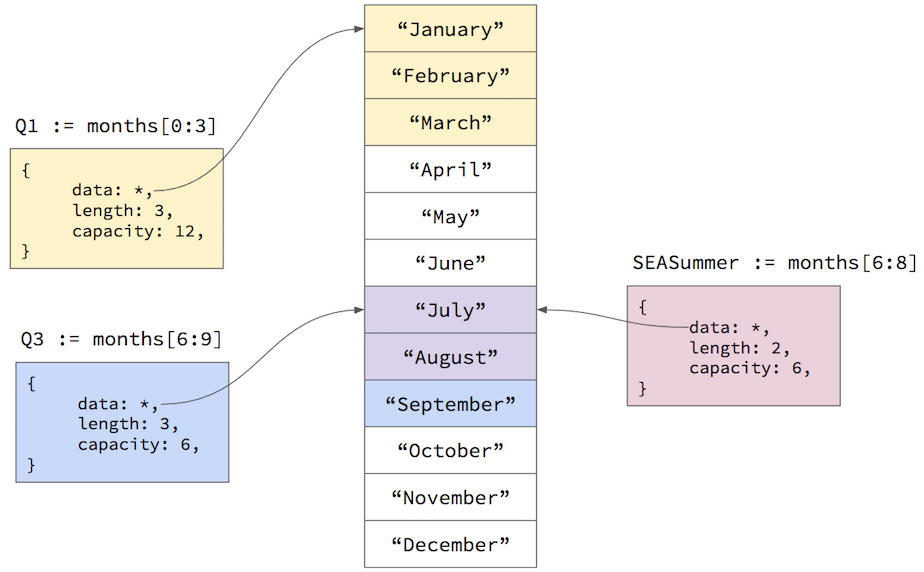

In addition to the [simple types](../golang/#secsimpletypes), Go offers two other complex types that are exceedingly useful: slices and maps. In this tutorial I will explain what these types are, how to use them, and clarify the relationship between slices and their underlying storage, which are known as arrays.

## Arrays

To understand slices, you first need to understand arrays. In Go an array is simply a fixed-size contiguous memory buffer divided into equally-sized segments according the array's data type. For example, creating an array of three `uint8` values will allocate a 24-bit memory buffer where each element is 8 bits long. The syntax for creating a fixed-size array looks like this:

```go
//initialize a fixed array of 3 uint8 numbers
//and initialize them all to 255
rgb := [3]uint8{255, 255, 255}
```

If you don't supply values in the initializer, the elements are set to the zero-value for the array's data type:

data type | zero value
----------|------------
any number type | `0`
string | `""` (zero-length string)
bool | `false`
any pointer type | `nil`

So the expression `[3]uint8{}` creates an array with three `uint8` values, all set to `0`.

After you create an array, you can access the elements by their zero-based index:

```go
r := rgb[0]
g := rgb[1]
b := rgb[2]
```

You can also get the length of the array using the built-in `len()` function:

```go
fmt.Printf("array length is %d\n", len(rgb))
```

Arrays are fixed in size: once you create them, you can't expand them or contract them without allocating a new array and copying the elements to the new array. So arrays are useful only when you need a fixed-size memory buffer or when you know you only need a fixed number of elements. For example, if you are reading 1024 bytes at a time from a file, you can allocate one `[1024]byte{}` array and read chunks into it as you scan the file. Or if you need to store an ordered list of the calendar months, you can safely assume that there are only 12 of them, and thus a fixed-size array would be appropriate:

```go
months := [12]string{"January", "February", "March", "April", 
	"May", "June", "July", "August", 
	"September", "October", "November", "December"}
```

If you need a more flexible ordered list that can expand as you add elements to it, that's what slices are for.

## Slicing Arrays

A slice in Go is like a flexible window over an underlying fixed-size array. A slice is actually a small struct that contains three fields: 

- a pointer to the first element in the underlying array that the slice can see
- the number of elements after the starting element that the slice can see (length)
- the total number of elements available in the array after the starting element (capacity)

For example, we can create a slice from our array of months using this syntax:

```go
//Q1 is a slice of the months array
//viewing just the first three months
Q1 := months[0:3]
```

The slice operator specifies two array element indexes: the first element in the array the slice can see; and the element after the last element the slice can see. In other words, the slice will be able to see the elements from the first index up-to but not including the second index. So the expression `months[0:3]` creates a slice that can see indexes `0`, `1`, and `2`. The expression `months[0:1]` creates a slice that can see only element `0`. The following shows this graphically:


The reasoning behind the "up-to but not including" second index value is that it makes it easy to use `len(months)` as the second index to get all the elements from the starting index through the end of the array. In fact, this is such a common operation that the second index defaults to `len(months)` so you can just omit it: the expression `months[9:]` is the same as `months[9:len(months)]`. Similarly, the first index defaults to `0`, so the expression `months[:3]` is the same as `months[0:3]`. Not surprisingly, `months[:]` is the same as `months[0:len(months)]`.

You can create multiple slices off the same array, and they can also overlap each other:



You can also create slices from slices using the same syntax. The expression `Q1[0:1]` returns a slice pointing to the same starting element in the underlying array, but the length of the new slice would be `1` instead of `3`.

## Creating and Appending to Slices

Slicing existing arrays is useful, but what if you don't know how many elements you might need? What if you just want an ordered list of elements that automatically grows as you add more elements to it?

Slices combined with the built-in `append()` function provide this kind of functionality. If you don't know how many elements you might need, you can start by just creating a slice, which automatically allocates an underlying array that is hidden from you:

```go
//create a slice of strings with an automatically-allocated
//underlying array that you can't see or reference
names := []string{}
```

The syntax is similar to how you declare a fixed-length array, but you omit the number of elements between the `[]` symbols. The slice will point to an underlying array, but the slice's length will be zero, and its capacity will be the size of that automatically-allocated underlying array.

You can then add new values to this slice using the built-in `append()` function:

```go
//append takes the slice and the value to add to it;
//it then returns the original slice or a new slice
//if it has to grow the underlying array
names = append(names, "Alice")
names = append(names, "Bob")
names = append(names, "Chang")
```

Note that we re-assign the `names` variable to the return value of `append()`. The underlying array naturally has a fixed length, and it may be full, so the `append()` function might need to allocate a new larger array to hold the new value. If so, the `append()` function will allocate a new larger array, copy the elements from the original array to the new array, and return a new slice pointing to the new underlying array. The old array and slice then fall out of scope and are eventually garbage collected. If the underlying array has a enough capacity to hold the new value, `append()` will simply put the value into the next available element and return the original slice.

Note that the `append()` function is smart enough to handle the first parameter being `nil`. For example, say you had a struct field that was typed as `[]string` (a slice of strings), and you create an instance of that struct without providing any field initializers. That field will have the value of `nil`, but it's OK to pass that as the first argument to `append()`. When you do, `append()` will simply create a new underlying array, put the value in the first position, and return a slice over that new underlying array.

```go
type SharedLink struct {
	PageURL string
	Keywords []string
}

func main() {
	//create an instance of SharedLink,
	//setting only the PageURL field.
	//the PageURL field remains nil
	sl := &SharedLink{
		PageURL: "https://ischool.uw.edu",
	}

	//append a keyword to the slice of string
	//append() will see that sl.Keywords is nil, 
	//and just allocate a new array, returning a 
	//slice over that newly allocated array
	sl.Keywords = append(sl.Keywords, "iSchool")
}
```

## Iterating Slices

Since you can access an element using an index, you can iterate over a slice using a traditional `for` loop, but go also offers a more convenient `for...range` loop that works with slices and arrays:

```go
for i, name := range names {
	fmt.Printf("%d = %s", i, name)
}
```

The `range` operator iterates over the slice or array, setting the `i` variable to the element index and the `name` variable to the element value. If you only care about the element value and don't need the element index, you can use the `_` symbol (known as the "blank identifier") for the first variable:

```go
for _, name := range names {
	fmt.Printf("%s", name)
}
```

If you just need to iterate forwards over an entire slice or array, use the `for...range` loop: it's less error-prone and shorter to type. But if you need to iterate backwards, or skip elements, use a traditional `for` loop.

## Maps

In addition to arrays and slices, which are ordered lists, Go also has a built-in map type, which is an associative set of key/value pairs. Maps are currently implemented using hash tables, which are very efficient data structures for storing and retrieving key/value pairs. Go maps are just like JavaScript Objects (which are just hash tables under the hood), except that Go maps are statically-typed: you declare the data types for keys and values when you declare the map, and the Go compiler ensures that only keys and values of those types can be added to the map.

For example, to create a map where the keys are strings and the values are numbers, you use a syntax like this:

```go
//creates a map of string keys to int values
//you can supply values in the {} initializer
//if you want to pre-populate the map with
//a few key/value pairs
occurrences := map[string]int{}
```

The syntax for adding a key/value pair to the map, and getting a value for a key, looks like this:

```go
word := "the"
//add an entry with key "the" and value 1
occurrences[word] = 1
//get the value associated with the key 
count := occurrences[word]
```

If you request the value for a key that does not yet exist, the map will return the zero-value for the value's data type. Often times this works out well since your code doesn't have to worry about checking whether the key exists before using the value. For example, since the zero-value of an `int` is `0`, we can count the occurrences of words in text with code like this:

```go
text := "... some long text ..."
words := strings.Split(text, " ")
occurrences := map[string]int{}
for _, w := range words {
	occurrences[w]++
}
```

This code splits the input text into a slice of words and the iterates over that slice using the `for...range` loop described [earlier](#seciteratingslices). As it iterates, it increments the integer value associated with the word in the map. If the word is not yet added to the map, the expression `occurrences[w]` will return `0`. The `++` operator then increments that value and sets it as the value for the current word.

If you really need to know whether a key is in the map, you can add another variable when accessing the map:

```go
count, exists := occurrences["the"]
```

The `count` variable will be set to the current value, or the zero-value if the key doesn't exist. The `exists` variable will be set to `true` if the key exists in the map, or `false` if not.

## Iterating Maps

Like slices and arrays, maps can be iterated using the `for...range` loop:

```go
for word, count := range occurrences {
	fmt.Printf("%s appears %d times", word, count)
}
```

But since maps are hash tables, the key/value pairs are in no particular order. In fact, Go will [randomize the iteration order](https://blog.golang.org/go-maps-in-action) just to make sure you don't depend on some particular ordering that may change in the future (this is another example where it's obvious this language was designed by seasoned developers who have been bitten by bugs resulting from spurious assumptions about past behavior that was not actually guaranteed). Each time you run the `for...range` loop above, it will list the words in a different order.

If you want to iterate the map in some particular order (e.g. by the keys sorted alphabetically), you must first extract the keys into a slice, sort the slice, and then iterate that sorted slice:

```go
//make a string slice with enough capacity to hold all the keys
keys := make([]string, 0, len(occurrences))

//range over the keys and append them to the slice
for k := range occurrences {
	keys = append(keys, k)
}

//sort the slice of keys alphabetically
sort.Strings(keys)

//iterate over the keys, looking up
//the associated value in the map
for _, k := range keys {
	fmt.Printf("%s appears %d times\n", k, occurrences[k])
}
```

[<span class="button is-primary">Run in the Go Playground</span>](https://play.golang.org/p/gajzuHwiw5)


The [make() function](https://golang.org/pkg/builtin/#make) is used to create a slice with an underlying array that has a particular capacity. Since we can use the `len()` function to determine how many keys are in the map, we can save unnecessary memory allocations by presetting the slice capacity to the number of keys in the map. That way the `append()` function never has to reallocate the underlying array, as it will always have enough room to fit all the keys.

We then range over the map, but this time we only access the keys in order to append them to the slice. After appending all the keys, we sort the slice alphabetically using the [sort.Strings()](https://golang.org/pkg/sort/#Strings) function. Finally, we iterate the sorted slice of keys, using the current key to get the associated value from the original `occurrences` map.


