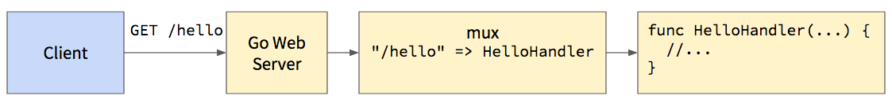

As I mentioned in the [HTTP tutorial](../http/), a web server is just a program that listens on a port for HTTP requests and responds accordingly. You can write a web server in any language that gives you access to the computer's network interface, but some languages include code in their standard library that handles all the low-level details for you. Go is one of those languages, so building a simple web server in Go is quite easy. The standard library takes care of most of the work, allowing you to focus on the server's logic and functionality.

## Hello Web in Go

When we [learned the Go language](../golang/), we started with the traditional ["Hello, World!" program](../golang/#sechelloworldingo). To learn Go web servers, we should start with a "Hello, Web!" program:

```go
package main

import (
	"log"
	"net/http"
	"os"
)

//HelloHandler handles requests for the `/hello` resource
func HelloHandler(w http.ResponseWriter, r *http.Request) {
	w.Write([]byte("Hello, Web!\n"))
}

func main() {
	//get the value of the ADDR environment variable
	addr := os.Getenv("ADDR")

	//if it's blank, default to ":80", which means
	//listen port 80 for requests addressed to any host
	if len(addr) == 0 {
		addr = ":80"
	}

	//create a new mux (router)
	//the mux calls different functions for
	//different resource paths
	mux := http.NewServeMux()

	//tell it to call the HelloHandler() function
	//when someone requests the resource path `/hello`
	mux.HandleFunc("/hello", HelloHandler)

	//start the web server using the mux as the root handler,
	//and report any errors that occur.
	//the ListenAndServe() function will block so
	//this program will continue to run until killed
	log.Printf("server is listening at %s...", addr)
	log.Fatal(http.ListenAndServe(addr, mux))
}
```

## Compile, Install, and Run

Before I explain each piece of this, let's try running it. Create a new directory inside your `$GOPATH/src` directory named `hellosvr` and create a new file in that directory named `main.go`:

```bash
mkdir -p $GOPATH/src/hellosvr
cd $GOPATH/src/hellosvr
touch main.go
```

Open that main.go file in your favorite editor and copy the code above into it. Then run these commands to set the `ADDR` environment variable, compile/install the server, and start it:

```bash
export ADDR=localhost:4000
go install
hellosvr   #hellosvr.exe on Windows
```

The `export ...` line sets an [environment variable](../env/) that is visible within this shell and any program launched from this shell. Our program above reads this environment variable at the start of the `main()` function to know which network address it should listen on. Using an environment variable instead of a hard-coded string makes our program more flexible. We can switch this network address without having to recompile the program.

The `go install` command will compile the executable and install (copy) it to the `$GOPATH/bin` directory. If you get an error while running `go install`, that's probably due to a compilation error. Read the error message carefully, and check the code to make sure you copied it completely and correctly.

If you get a "command not found" error while running `hellosvr` (or `hellosvr.exe` on Windows), ensure that you added `$GOPATH/bin` to your [system path in a persistent way](../env/#secdeclaringpersistentuserglobalvariables). If `$GOPATH/bin` is not in your system path, you can be more explicit about where the executable is: `$GOPATH/bin/hellosvr`.

If all went well, you should see a message saying `server is listening at localhost:4000...` and your command-line will remain occupied as the server is still running. To test the server, open a web browser and go to the URL [http://localhost:4000/hello](http://localhost:4000/hello). You should see "Hello, Web!" in the browser window.

If you're more of a command-line person, you can also test this server using `curl`. Open another terminal window and execute this command:

```bash
curl http://localhost:4000/hello
```

If you want to see the response headers, include the `-i` flag:

```bash
curl -i http://localhost:4000/hello
```

And if you want to see all the request and response details, use the `-v` flag:

```bash
curl -v http://localhost:4000/hello
```

To stop the web server, hit `Ctrl+c` in the terminal window where you started it.

Note that in bash you can combine the install and run commands into one line like this:

```bash
go install && hellosvr   #hellosvr.exe on Windows
```

This will run the `go install` command, and if it is successful, will then run your built executable. This is handy during development when you need to restart your server after making changes to the source code. To restart, hit `Ctrl+c` to stop your server, and then use the up-arrow to recall the last command, which will be `go install && hellosvr`. Then hit enter to re-run the command, which will recompile your server with the changes, and restart it.

## Reading Environment Variables

The first line in `main()` reads an environment variable named `ADDR` to get the network address on which the server should listen. This address is in the form `"host:port"`, where `host` is the IP address or host name to bind to, and `port` is the port number to listen on.

```go
//get the value of the ADDR environment variable
addr := os.Getenv("ADDR")

//if it's blank, default to ":80", which means
//listen port 80 for requests addressed to any host
if len(addr) == 0 {
	addr = ":80"
}
```

We set this environment variable above using the `export ADDR=localhost:4000` command. Since `localhost` is defined in the hosts file as the loopback address, the address `"localhost:4000"` instructs the Go web server to listen on port 4000 for requests that come through the loopback address only. That means the server won't accept connections from other computers. If you want to accept connections from other computers, use the address `:4000` instead. That will listen for requests that come through any of the network interfaces on your computer.

If the `ADDR` environment variable is not set, we would get an empty string back from `os.Getenv()`. The `ListenAndServe()` function won't accept an empty address, as it needs to know at least which port number you want to listen on, so we handle this case by defaulting to `":80"`, which will accept requests from other computers and listen on the default HTTP port 80.

On a Unix-based operating system, only programs launched by the root account are allowed to list on low port numbers (<1024). On your development machine, you typically sign-in using a non-root user account, so to avoid having to use `sudo` when starting your server, it's common to use a port number greater than 1024. Any port number not already in use is fine. In production you should always listen on the standard HTTP or HTTPS ports, so that users don't have to include a port number in the URL.

## Muxes

The next few lines create a new mux and register one handler function for the `"/hello"` resource path:

```go
//create a new mux (router)
//the mux calls different functions for
//different resource paths
mux := http.NewServeMux()

//tell it to call the HelloHandler() function
//when someone requests the resource path `/hello`
mux.HandleFunc("/hello", HelloHandler)
```

The term **mux** is short for "multiplexer," meaning that it can handle requests for multiple resource paths while routing the request to the appropriate handler function. This mux is passed to the `http.ListenAndServe()` function as the second parameter, so all requests are passed to this mux. The mux then determines which function to call based on requested resource path.

The `.HandleFunc()` method adds a new resource path and associated handler function to the mux. When the mux receives a request for the resource path `/hello`, it will call our `HelloHandler()` function to handle the request.

The request processing flows like this:



If you use a resource path string like `"/hello"` that doesn't end with a `/`, the mux will call your handler function only when the requested resource path matches this string **exactly**. But if you use a resource path string like `"/hello/"` that does end with a `/`, the mux will call your handler function when the requested resource path **starts with** this string. So `"/hello"` will match only `"/hello"`, but `"/hello/"` will match `"/hello/"` and `"/hello/foo"` and `"/hello/foo/bar"`, etc. This starts-with matching can be handy when you want to support the use of unique row/document identifiers after the prefix (e.g., `"/users/123456"` for the user with ID `123456`).

You can of course add as many resource paths and associated handler functions to the mux as you want, but for can't add the same resource path twice. If you want multiple handler functions called for a given resource path, create a new handler function that calls the other ones. Or write a [generic compose function using closures](http://nauvalatmaja.com/2016/04/15/function-composition-in-go/).

The mux in the standard library is often adequate, but if you need more complicated routing, check out the [mux package in the Gorilla Toolkit](http://www.gorillatoolkit.org/pkg/mux). This package lets you use regular expressions in resource path strings, and filter based on HTTP methods, protocols, header values, etc.

## Handler Functions

The second parameter passed to the `.HandleFunc()` method must be a function with a very particular signature. The function must accept two parameters, the first of type `http.ResponseWriter` and the second of type `*http.Request`. The [http.ResponseWriter](https://golang.org/pkg/net/http/#ResponseWriter) type is an **interface** with methods that allow you to write HTTP response headers and body data. The `*http.Request` type is a pointer to an [http.Request](https://golang.org/pkg/net/http/#Request) struct, which contains information about the HTTP request. Our `HelloHandler()` function has this signature:

```go
//HelloHandler handles requests for the `/hello` resource
func HelloHandler(w http.ResponseWriter, r *http.Request) {
	w.Write([]byte("Hello, Web!\n"))
}
```

You can name the parameters whatever you want, but it's customary to name them `w` and `r` for "writer" and "request." The values passed for these parameters are created by the HTTP server in the Go standard library when a new request is received, so you can just use them without having to worry about how they were created.

Here we use the `http.ResponseWriter` to write a simple greeting string in plain text. The `.Write()` method accepts a byte slice so that you can write any sort of data to the response including binary, so we convert our string to a byte slice using the syntax `[]byte(...)`. In Go you can convert a value to another compatible type by using the target type name as a sort of function. For example, to convert a byte slice to a string, you use the syntax `string(myByteSlice)`. If the conversion can't be done automatically, or if it could fail for some reason (e.g., converting a string to an integer), you must use some other conversion function (e.g., [strconv.Atoi()](https://golang.org/pkg/strconv/#Atoi)) and handle any errors that occur.

## Handlers

In addition to the `.HandleFunc()` method, a mux also has a `.Handle()` method that accepts an `http.Handler` for a resource path. The [http.Handler](https://golang.org/pkg/net/http/#Handler) type is an interface with just one method: `ServeHTTP(http.ResponseWriter, *http.Request)`. Any struct that implements this method is an `http.Handler`.

Handlers are used for cases where your handler function needs access to some extra data. Since handler functions are called directly from the mux, and therefore must conform to the signature described earlier, there is no opportunity to pass extra data along as a third or fourth parameter. Instead, you can create a struct to hold that data, and implement the `.ServeHTTP()` method on that struct. When the `.ServeHTTP()` method is invoked, your method will have access to the struct data via the [receiver parameter](../golang/#secreceivers).

For example, say you wanted to invoke different functions depending on the requested HTTP method (a feature of the Gorilla Toolkit mux). You could support this fairly easily using a struct that tracked a handler function per-method:

```go
//MethodMux sends the request to the function
//associated with the HTTP request method
type MethodMux struct {
	//use a map where the  key is a string (method name) 
	//and the value is the associated handler function
	HandlerFuncs map[string]func(http.ResponseWriter, *http.Request)
}

//ServeHTTP sends the request to the appropriate handler based on
//the HTTP method in the request
func (mm *MethodMux) ServeHTTP(w http.ResponseWriter, r *http.Request) {
	//r.Method will be the method used in the request (GET, PUT, PATCH, POST, etc.)
	fn := mm.HandlerFuncs[r.Method]
	if fn != nil {
		fn(w, r)
	} else {
		http.Error(w, "that method is not allowed", http.StatusMethodNotAllowed)
	}
}

//NewMethodMux constructs a new MethodMux
func NewMethodMux() *MethodMux {
	return &MethodMux{
		HandlerFuncs: map[string]func(http.ResponseWriter, *http.Request){},
	}
}
```

Since the `MethodMux` struct implements `.ServeHTTP()` it can be used wherever an `http.Handler` is required, so you can pass it directly to the `mux.Handle()` method:

```go
mux := http.NewServeMux()

methmux := NewMethodMux()
methmux.HandlerFuncs["GET"] = HelloHandler

mux.Handle("/hello", methmux)
```

With this code, our `HelloHandler` function will be called only if the request method was `GET`. If the request method was something else, it will respond with a "method not allowed" error (status code 405). The `http.Error()` function conveniently writes the error message and status code to the response stream, but note that it doesn't stop processing the request. If you want to stop processing the request after writing an error to the response, simply `return` from the handler function.

If we wanted a different function called when the request method was `POST`, we just add that to the HanderFuncs map:

```go
methmux.HandlerFuncs["POST"] = SomeOtherHandlerFunction
```

You might have already guessed this, but the `http.ServeMux` struct is also an `http.Handler` because it implements the `.ServeHTTP()` method. The second parameter you pass to `http.ListenAndServe()` function is an `http.Handler` and this becomes the root handler for the server. All requests are passed to that handler's `.ServeHTTP()` method, and the handler processes the request according to its own logic. A handler might delegate the request to another handler, which is what we are doing in the code above. The `mux` will examine the requested resource path and if it matches `/hello`, the mux will invoke the `methmux.ServeHTTP()` method. That method then looks at the HTTP method in the request, and decides which handler function to invoke.

This ability to compose HTTP handlers is quite powerful. We will return to it when we learn about implementing middleware functions.

## Starting the Server

The last line of our program starts the server and logs any errors that occur:

```go
log.Printf("server is listening at %s...", addr)
log.Fatal(http.ListenAndServe(addr, mux))
```

The `http.ListenAndServe()` function starts the web server and blocks until the web server is stopped. If there was an error starting the server, it will return that error, and here we use `log.Fatal()` to log that error to the console.

Since `http.ListenAndServe()` blocks, it's common to write a status message to the log just before calling this function. If you confirm the address on which the server is attempting to listen, that can help you debug problems such as trying to listen on a low port when running as a non-root user.

## More Details

Everything you need to know about a given HTTP request is available on the [http.Request](https://golang.org/pkg/net/http/#Request) struct, or via one of it's methods. See the [Request documentation](https://golang.org/pkg/net/http/#Request) for more details.

Similarly, the [http.ResponseWriter](https://golang.org/pkg/net/http/#ResponseWriter) interface provides several methods for writing response status codes, headers, and body data. See the [ResponseWriter](https://golang.org/pkg/net/http/#ResponseWriter) documentation for more details.

