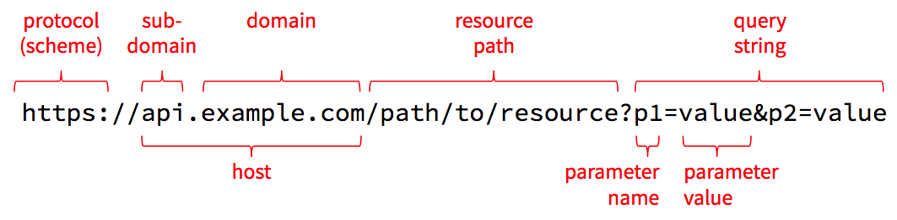
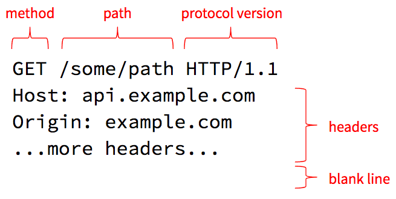

The thing that defines the web more than anything else is its underlying communication standard: the **H**yper**T**ext **T**ransfer **P**rotocol (HTTP). If you want to build successful web applications, you need to understand this protocol and how it works. The good news is that it's stupidly simple. One of the reasons the web grew as fast as it did is because the underlying protocol is clear, straightforward, and uncomplicated. Anyone can learn it in a matter of minutes, and once you learn it, you'll understand what's really happening when you browse the web, make HTTP requests from JavaScript, or handle those requests on the server-side.

## Key Terms

Before we look at the protocol itself, we need to review and solidify a few key terms. The best way to do that is to look at the anatomy of a URL. A URL is a string of characters, but it's divided into a few distinct parts, each of which is used during an HTTP request.



### Protocol

The first part of the URL names the **protocol** to use, which is sometimes referred to as the **scheme**. The name `http` refers to HTTP, and `https` refers to a combination of HTTP and [Transport Layer Security (TLS)](https://en.wikipedia.org/wiki/Transport_Layer_Security). When using TLS, all requests and responses are encrypted as they are sent across the network so that an attacker in the middle can't read the contents. This results in a bit of computational and size overhead, but today's computers and networks are fast-enough that HTTPS is quickly becoming the standard for all web traffic.

Never enter sensitive information into a web page where the URL starts with `http`, and never send sensitive data from JavaScript over an `http` connection. Anyone with access to the network can read everything sent over `http` in plain text. Make sure you use `https` when transmitting sensitive information.

### Host

The next part is the **host** which is the name of the computer we want to talk to. The host can be a domain name such as `example.com`, or it can be a sub-domain like `api.example.com` or `ischool.uw.edu`. Domain names have to be purchased from domain registrars, but once you register one, you can create as many sub-domains as you like and adjust them whenever necessary.

To make a network connection, the client needs to translate the host name into a numeric IP address. It does this using the [Domain Name System (DNS)](https://en.wikipedia.org/wiki/Domain_Name_System). The DNS is a bit like a telephone book that one can use to resolve a host name to an IP address, and you can access it right from the command line. Open a new command-line window (Terminal on Mac or Git Bash/Linux Subsystem on Windows) and type this command:

```bash
nslookup ischool.uw.edu
```

_Sample Output_

```
Server:		192.168.0.1
Address:	192.168.0.1#53

Non-authoritative answer:
Name:	ischool.uw.edu
Address: 128.208.201.29
```

In addition to [nslookup](https://linux.die.net/man/1/nslookup), Mac and Linux users can also use the more concise [host](https://linux.die.net/man/1/host) command:

```bash
host ischool.uw.edu
```

_Sample Output_


```
ischool.uw.edu has address 128.208.60.39
ischool.uw.edu has address 128.208.203.143
```

The iSchool host name resolves to two addresses, but other domain names might resolve to even more possible addresses. For example, try `uw.edu` instead. It should return several IP addresses, any of which can be used by a web client.

Mac and Linux users can also use the more powerful `dig` command to see details about the query sent to the DNS and its reply:

```bash
dig ischool.uw.edu
```

These commands talk to the DNS, but they also consult a hosts file on your local computer that contains well-known host names and their associated IP addresses. On Mac and Linux, this file is at `/etc/hosts`, and on Windows it's at `c:\Windows\System32\Drivers\etc\hosts`. To see the contents of this file use this command:

```bash
# on Mac and Linux
cat /etc/hosts

# on Windows
cat c:\Windows\System32\Drivers\etc\hosts 
```

You'll probably have at least one line in that file that defines the host `localhost` to be the IPv4 address `127.0.0.1`, and possibly another line that defines the IPv6 address to be `::1`. These are known as "loopback addresses" because they just loop back to the same machine from which the request is made: your local computer. Thus, the host `localhost` is an alias for your computer.

### Port

The host and associated IP address can get you connected to a server across the Internet, but that server might be listening for network requests on many different ports. You can think of an IP address like the street address of an apartment building, while the **port number** is the number of a specific apartment inside. To connect to a web server, we need both the host/IP and a port number.

As a convention, web servers listen on port `80` for unencrypted HTTP requests, and port `443` for encrypted HTTPS requests. If you don't specify a port number in your URL, the browser will assume these conventional ports. But you can override this by including a port number in your URL, like so: `http://localhost:4000/path/to/resource`. This tells the client to connect to port `4000` instead of the conventional port `80`.

### Origin

A quick aside: the combination of the protocol, host, and port defines an **origin** in HTTP. Origins are the primary security boundary within the browser. Data written to local storage can be read only by code served from the same origin. Cookies are automatically sent during requests to the same origin from which the cookie came, but never to other origins. By default, HTTP requests initiated from JavaScript are limited to the same origin from which the JavaScript came (see the [CORS](../cors/) tutorial for more details on how to override this on the server).

### Resource Path

After the host and optional port number, the segment up until the `?` is known as the **resource path**. Technically, this can take any form that the server knows how to interpret, so it doesn't strictly need to look like a file path, but that path syntax is useful for modeling any set of hierarchically-organized resources.

Although this looks like a file path, it's critical for server-side development to understand that **it can refer to anything the server can manipulate**: a file, a database table/record, an in-memory game state, a neural network, a connected device, or even a controller for a giant mechanical killer robot. The term "resource" is purposely vague and open-ended so that one can enable the manipulation of [just about anything via HTTP requests](https://en.wikipedia.org/wiki/Hyper_Text_Coffee_Pot_Control_Protocol).

### Query String, Parameters, and Values

The last part of the URL above contains the **query string**, which allows the client to pass additional parameters and values that are relevant for the requested resource. These parameters are typically used only when getting the state of the resource, and they are often used to supply filters, sorts, or other options supported by the resource. For example, when getting the `/users` resource, which represents all user accounts in the system, one might supply a query string like `?q=dave&max=50` to find the first 50 users with the name `dave`.

The query string starts with a `?` and is followed by one or more name/value pairs. The name/value pairs are separated by `&`. The name and value are separated by `=`. For obvious reasons, literal `&` and `=` characters within parameter names or values must be encoded as `%26` and `%3D` respectively, and a literal `%` must be encoded as `%25`. The number after the `%` is the hex representation of the character's Unicode number. The `encodeURIComponent()` function in JavaScript can be used to do this encoding in the browser, and similar functions are available in most other languages.

Technically speaking, `- _ . ! ~ * ' ( )` and space must also be encoded, as well as characters outside the ASCII range, but most client libraries handle this for you, so you rarely need to worry about this. 

## HTTP Requests

Now that we have our terms straight, let's see how these URL elements are used in an HTTP request.



HTTP 1.1 requests are just plain text, so you can easily read and type them. The first line (simply called the "request line") contains the **method**, **resource path** (which we already discussed [earlier](#secresourcepath)), and requested **protocol version**.

### Methods and Resources

The core philosophy of HTTP is that clients invoke _methods_ on _resources_. The resource is the object and the method is the verb. Or to put it another way, the resource path identifies a thing the server can manage, and the method specifies an action the server should take on that resource.

There are several methods defined in the HTTP standard, and the most commonly-used are as follows:

method | meaning
-------|--------
GET | return the current state of the resource
PUT | completely replace the current state of the resource
PATCH | partially update the current state of the resource
POST | add a new child resource
DELETE | delete the resource
LINK | link the resource to some other resource
UNLINK | unlink the resource from some other resource
OPTIONS | list the methods the current user is allowed to use on this resource

Servers may choose to support other methods, including custom methods they define. This is generally fine, but sometimes you can run into troubles if there is a proxy server in the middle that rejects requests with non-standard methods for security reasons. In that case, developers commonly use `POST` with a query string parameter or other custom header that indicates what the real method is.

### Protocol Version

The request line ends with a protocol version the client wishes to speak. HTTP, like all standards, is an evolving one, and there have been a few versions of HTTP defined over the years. The example above uses [HTTP/1.1](https://tools.ietf.org/html/rfc2616) which is widely supported, but [HTTP/2.0](https://developers.google.com/web/fundamentals/performance/http2/) has now been defined and support for it is growing.

By allowing clients to request a particular protocol version, servers and clients can start supporting the newer version while still being able to fall back to the older version if the other side doesn't yet support the new version. For example, a client can request `HTTP/2.0` but the server can reply saying it only supports `HTTP/1.1`. The client can then gracefully downgrade and use the 1.1 version for the rest of the conversation.

### Headers

The next lines in the request specify one or more **headers**. A header is a name/value pair, like a parameter, that provides some additional meta-data about the request. The `Host` header is required on all requests and must be set to the [host name](#sechost) the client thinks it is talking to. This allows a single server to host several different web sites at the same time: it can use the `Host` header to determine which site the client is requesting.

The HTTP specification defines several [standard headers](https://www.w3.org/Protocols/rfc2616/rfc2616-sec14.html). The ones you will most commonly use when making requests are as follows:

header | meaning
-------|--------
Authorization | Some sort of token that identifies an authenticated session or a user account. The server defines what it accepts in this header.
Content-Length | If you are sending content to the server, this specifies how many bytes you are sending. This is typically set for you automatically by the library you use to make the request. This tells the server how much data to expect so it knows when its done reading the request off the network.
Content-Type | If you are sending content, this specifies the [MIME type](https://en.wikipedia.org/wiki/Media_type) you are using for that data (e.g., JSON, XML, HTML, or some sort of media type).
Cookie | A value the server provided in the `Set-Cookie` response header during a previous request. Cookies are handled automatically within the browser and by most HTTP client libraries that offer a "cookie jar" implementation.
If-Modified-Since | If set to a date/time, the server will respond with the resource's state only if that state has been modified since the specified date/time. Useful when requesting large resources that don't change very often (video, large images, etc).

## Let's Try It!

As noted earlier, HTTP/1.1 is just plain text so you can manually type HTTP requests at the command line. So let's do it! We will use the `nc` (netcat) command to manually send an HTTP request to Google's web server and view the responses.

Open a new command line window. If you're on Mac or Linux, you already have the `nc` command installed. If you're on Windows and if you have Docker installed, you can run a BusyBox Linux container and use the `nc` command from within the container. To run a BusyBox container, use this command (requires Docker):

```bash
docker run -it --rm busybox
```

Now use the `nc` command to connect to port 80 on Google's web server, and then type the remaining two lines of text exactly as you see them below. After the second line hit Enter twice to send a blank line, which signals the end of your request.

```bash
nc www.google.com 80
GET / HTTP/1.1
Host: www.google.com

```

After you send the blank line it should respond with a standard HTTP response message followed by a bunch of HTML. That's Google's home page! You requested the resource path `/`, which is the home page for the entire web site.

Hit `Ctrl+c` to exit out of netcat and return to your own command prompt.

What you just did is what your web browser does when you enter `http://www.google.com/` into the address bar. The browser parses the URL and determines that the protocol is `http`, the host is `www.google.com` and the resource path is `/`. It then opens a network connection to port 80 (default for HTTP) on `www.google.com` and sends at least those two lines (most browsers include a bunch more headers that provide the server with extra meta-data).

## HTTP Responses

After making your request, the server will respond with a message that looks something like this:


The first line tells the client what version of the protocol the server is using, as well as the response status code and message.

### Status Codes

The status code tells the client whether the request was successful or not. There are several [status codes defined in the HTTP standard](https://www.w3.org/Protocols/rfc2616/rfc2616-sec10.html), but they bucket into the following ranges:

range | meaning
------|--------
100-199 | still working on it, more to come
200-299 | successful
300-399 | request the URL in the `Location` response header instead
400-499 | client made a bad request
500-599 | something went wrong on the server-side

Most HTTP client libraries will handle 100 and 300-range status codes automatically, so your client-side code only has to deal with 200, 400, and 500-range codes. In general, you should treat any code >= 400 as an error, but note that these error-range codes are distinct from a network error: if the host is unreachable you will get a network error and no response at all.

The message that follows the status code is mostly redundant, but it's helpful in cases where a service defines new non-standard status codes, such as those defined in the now famous [HyperText Coffee Pot Control Protocol](hhttps://en.wikipedia.org/wiki/Hyper_Text_Coffee_Pot_Control_Protocol) (check out the meaning of [status code 418](https://tools.ietf.org/html/rfc2324#section-2.3.2)).

### Response Headers

Similar to requests, HTTP responses also contain one or more headers. These headers can provide additional meta-data about the response. The most commonly-used ones are as follows:

header | meaning
-------|--------
Content-Type | The [MIME type](https://en.wikipedia.org/wiki/Media_type) used for the data in the response body. For example `application/json; charset=utf-8` means that the response body contains data encoded into JSON using the [UTF-8 character set](https://en.wikipedia.org/wiki/UTF-8).
Content-Length | The number of bytes the server is sending in the response body.
Expires and Cache-Control | Specifies if and for how long the client may cache the response body.
Last-Modified | The date/time the resource was last modified (can be used in the `If-Modified-Since` header during subsequent requests for this resource if the server says its OK to cache the response).
Location | For 300-range (Redirect) responses, a URL that the client should ask for instead; for 201 (Created) responses, the URL for the newly-created resource.
Retry-After | The number of seconds, or a specific date/time, after which the client may ask for the resource. This is commonly returned when the server is throttling requests and the client makes too many within a given time period. The client should wait until the Retry-After time before making another request.
Set-Cookie | A cookie value that should be sent back in the `Cookie` header with all subsequent requests to this same origin. Cookies are handled automatically in the browser and by most HTTP client libraries that support a "cookie jar" implementation.

### Response Body

Following the response headers is the response body. For a `GET` request, this will be the current state of the requested resource, encoded in the MIME type specified in the `Content-Type` response header. The number of bytes in the response body is indicated by the `Content-Length` header. If the server doesn't know the final total size, but still wants to start writing the data is has, the server can use [chunked transfer encoding](https://en.wikipedia.org/wiki/Chunked_transfer_encoding), which involves writing chunks of data at a time, each proceeded by a content length.

## HTTP/2

The examples so far have been in version 1.1 of HTTP, which uses simple plain-text, human-readable messages. Although these plain text messages make the protocol easy to see and understand, they are not as efficient as a more-compact, binary protocol would be. These inefficiencies led many browser and server vendors to experiment with binary protocols (e.g., SPDY), which eventually became the basis for a new version 2.0 of HTTP, known as [HTTP/2](https://http2.github.io/). This version is now supported by all the major browser vendors, as well as more recent web servers (e.g., NGINX has supported it since version 1.9.5 released in September 2016, and the web server in the Go standard library has supported it since Go 1.6 was released in February 2016).

Although HTTP/2 is no longer human-readable, it still retains all the same concepts outlined in this tutorial. The developer tools within the browsers will still show you all the request and response headers, bodies, and status codes, but on the wire they are encoded into a very company binary format. This should increase the overall speed of requests/responses, while also reducing the number of bytes that have to be transmitted across our networks.

For more details, see the [HTTP/2 specification (RFC 7540)](https://tools.ietf.org/html/rfc7540).
