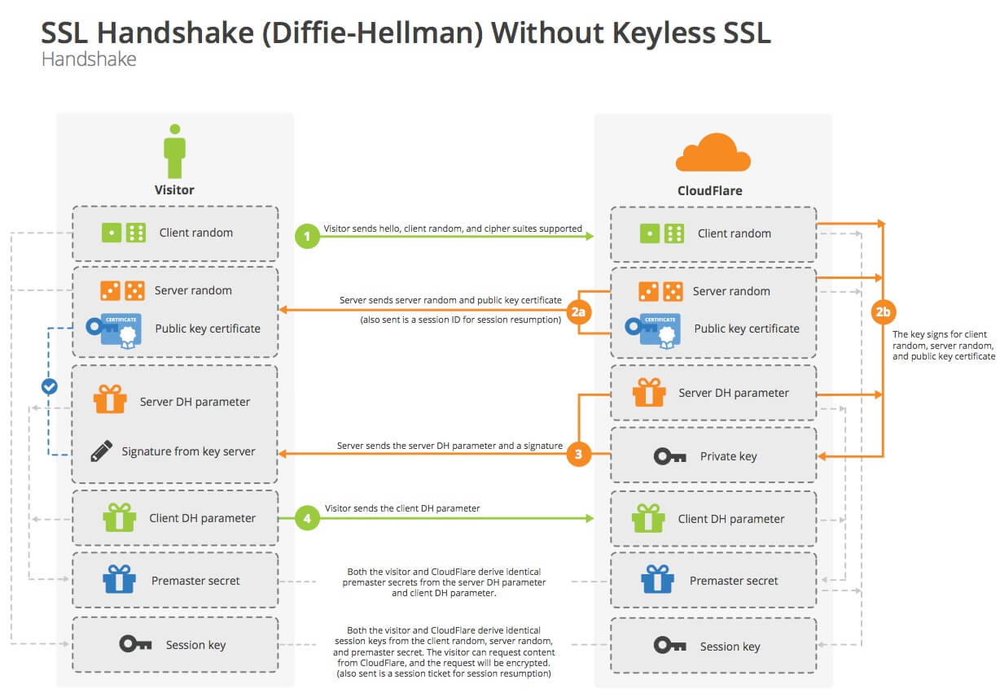

The basic HTTP protocol sends requests and responses in plain text, which anyone in the middle can read. This is problematic if we ever want to send sensitive information, such as email addresses, passwords, or authenticated session tokens. Thankfully we can encrypt all communication between a web client and server by using Transport Layer Security (TLS). This is what your browser uses when you request a URL that start with `https://`.

## How TLS Works

TLS uses a combination of symmetric and asymmetric encryption. If you don't remember what those terms mean, here's a brief refresher:

- **Symmetric encryption** uses one key to both encrypt and decrypt. That "key" is actually a large cryptographically-random array of bits (currently 128 or 256 bits). Symmetric algorithms are quite fast and memory-efficient on today's hardware, but intractable to crack in a reasonable amount of time if you don't know the key.
- **Asymmetric encryption** uses a [pair of mathematically-related keys](http://www.muppetlabs.com/~breadbox/txt/rsa.html), one that must be kept private and secure (the private key) and one that can be shared freely with the public (the public key). You can encrypt with either, but you can only decrypt with the other. That is, if you encrypt with the public key, you can only decrypt using the associated private key, and vice-versa. If Bob wants to send Alice an encrypted message, Bob encrypts the message using Alice's _public key_ (which is freely shared), and then only Alice can decrypt it, because only Alice has the _private key_ (which must be kept private and secure). Asymmetric encryption is much slower and memory-intensive than symmetric, so it's typically used for only small amounts of data.

Symmetric encryption is much more efficient, but it poses a significant problem: how do you share the symmetric key with the recipient across an insecure network without it being intercepted? If an attacker-in-the-middle is able to intercept the symmetric key, the attacker could decrypt all the traffic being exchanged.

This is where asymmetric encryption can help. We can do the following: 

1. use asymmetric encryption to share a secret between the client and server that only the server can read; 
1. use that secret to generate a new symmetric key; 
1. and then switch to symmetric encryption for the rest of the conversation. 

Here's a graphical representation of the flow, which comes from [CloudFlare's](https://www.cloudflare.com/) excellent article, [Keyless SSL: The Nitty Gritty Teachnical Details](https://blog.cloudflare.com/keyless-ssl-the-nitty-gritty-technical-details/)

[](img/ssl_handshake_diffie_hellman.jpg)

_source: CloudFlare, [Keyless SSL: The Nitty Gritty Teachnical Details](https://blog.cloudflare.com/keyless-ssl-the-nitty-gritty-technical-details/)_

The client gets the server's public key from the server's certificate (which I will explain in more detail in the next section). After some negotiation regarding which cipher suite to use, the client then generates a "pre-master secret" and encrypts it using the server's public key. Since the server is the only agent that possesses the associated private key, only the server can read this pre-master secret. The client sends that encrypted pre-master secret to the server, the server decrypts it, and then both use the pre-master secret to calculate a new "shared secret," which will be the symmetric encryption key they use for the rest of the conversation.

The algorithm for generating the shared secret is known as [Diffie-Hellman](https://security.stackexchange.com/a/45971). It uses some cool math so that both the client and server can arrive at the same shared secret without ever sending that secret across the wire. This adds some forward-secrecy: if an attacker recorded the handshake traffic, and was somehow able to decrypt it later (e.g., manages to steal the server's private key), the attacker still couldn't read the symmetrically-encrypted conversation, as the shared secret was never transmitted.

## Digital Certificates

As I noted above, the client gets the server's public key from the server's certificate. If you want to sound cool and in-the-know, you refer to this as a "cert." The cert is just a file that is digitally-signed by a trusted organization known as a Certificate Authority (CA). The file contains information about the web site (most importantly, the domain name), as well as the server's public key.

As you might remember, the recipient of a [digitally-signed document](https://www.docusign.com/how-it-works/electronic-signature/digital-signature/digital-signature-faq) can verify that the document hasn't been modified since it was signed. The "signature" is actually an asymmetrically-encrypted hash of the document at the moment of signing. The signer hashes the document, encrypts the hash with the signer's private key, and adds the encrypted hash to the document. Any receiver can then decrypt the signature using the signer's public key, rehash the document, and compare the two hashes. If the hashes are different, the recipient knows the document was either modified, or signed by someone else.

The digital signature lets your browser verify that the cert hasn't been modified since it was signed, but since anyone can generate signing keys and a digital signature, how does your browser know that it should trust the signer? Couldn't someone just generate a cert claiming their server is facebook.com and sign the cert themselves? How does your browser distinguish between that and the legitimate facebook.com?

The answer is that your computer's operating system ships with a set of "root certs," which are certs for the CAs your computer trusts implicitly. Your computer will also trust any cert signed by one of those root CAs, as the trusted CA is vouching for the legitimacy of the other cert holder. CAs can also sign certs with special signing permissions for other CAs, who can then sign certs for web sites. This creates a hierarchical chain of trust: if the client follows the chain of signatures backwards and eventually reaches one of the trusted roots, the certificate will be trusted.

After the client validates that the cert hasn't been modified and that it was signed by a trusted CA, the client will then verify that the domain name in the cert matches the domain name the client thinks it's talking to. If an attacker-in-the-middle intercepted your handshake with facebook.com and returned a valid cert for a domain the attacker controlled, your browser would still reject it, as the domain name in the cert won't match the domain it thinks it's talking to.

## Obtaining Certificates from Let's Encrypt

Given all of that, it should now be clear that supporting HTTPS requires three things:

1. A domain name pointing to your server's IP address;
1. A certificate, signed by a CA, containing your server's domain name and public key, which your server freely shares with all clients;
1. An associated private key that is kept on the server and never revealed.

Obtaining the first involves registering a domain name. Obtaining the second and third can be obtained for free using [Let's Encrypt](https://letsencrypt.org/).

### Register and Host a Domain Name

You can obtain a domain name from any domain registrar. My current favorite is [Hover](https://www.hover.com/), though [Namecheap](https://www.namecheap.com/) is also popular, and currently offers [free domain names for students](https://nc.me/).

Once you have your domain name, you can [host that domain name with DigitalOcean](https://www.digitalocean.com/community/tutorials/how-to-set-up-a-host-name-with-digitalocean), pointing it at one of your running droplets. You can also define new sub-domains that point to different droplets: this enables you to have `example.com` point to a droplet that hosts your web client, while `api.example.com` points to a different droplet running your API server. If you ever need to scale out, you can point `api.example.com` to a [load balancer](https://www.digitalocean.com/community/tutorials/how-to-create-your-first-digitalocean-load-balancer) instead that distributes the requests amongst a group of droplets, each running a copy of your API server.

### Run the Let's Encrypt Command

After you register and host your domain name, you need to `ssh` in to your droplets and run the `letsencrypt` command. If you created your droplets using DigitalOcean's "Docker x.x.x-ce on Ubuntu 16.04" One-Click app configuration, then the `letsencrypt` command is already installed and ready for use.

The command will start a web server listening on ports 80 and 443, so you need to open those ports on the firewall. To do that, use these commands while connected to your droplet via `ssh`:

```bash
sudo ufw allow 80
sudo ufw allow 443
```

After the ports are open, you can run the Let's Encrypt command using this command, replacing `your-domain.com` with your domain name:

```bash
sudo letsencrypt certonly --standalone -d your-domain.com
```

The command will prompt you for an email address (for expiry notifications) and to accept their terms of service. After you do that, it will start its own web server and communicate with the central Let's Encrypt servers. It will ensure that the domain name you passed as the `-d` flag is pointing to the current server, after which it writes your server's cert and private key to the following files (replace `your-domain.com` with the name of your domain):

- `/etc/letsencrypt/live/your-domain.com/fullchain.pem` : your server's certificate, along with all the other intermediate and root CA certs.
- `/etc/letsencrypt/live/your-domain.com/privkey.pem` : your server's private key.

Note that these files are actually symbolic links to files in the `/etc/letsencrypt/archive` directory. This will matter when we start trying to read them using a Docker mapped volume. More details in the sections that follow.

> **Pro Tip:** if you want to script the letsencrypt command, you can agree to the terms of service and supply your email address via command-line flags. Use this command, replacing `your-email-address` with your email address: `sudo letsencrypt certonly --standalone -n --agree-tos --email your-email-address -d your-domain.com`

## Supporting HTTPS in Go

Go servers can use the cert and key generated by Let's Encrypt to support HTTPS connections. Instead of using `http.ListenAndServe()` use `http.ListenAndServeTLS()`, like so:

```go
func main() {
	addr := os.Getenv("ADDR")
	if len(addr) == 0 {
		addr = ":443"
	}

	//get the TLS key and cert paths from environment variables
	//this allows us to use a self-signed cert/key during development
	//and the Let's Encrypt cert/key in production
	tlsKeyPath := os.Getenv("TLSKEY")
	tlsCertPath := os.Getenv("TLSCERT")

	mux := http.NewServeMux()
	//...and handlers

	//start the server
	fmt.Printf("listening on %s...\n", addr)
	log.Fatal(http.ListenAndServeTLS(addr, tlsCertPath, tlsKeyPath, mux))	
}
```

With this code, your Go server will only support HTTPS requests, not HTTP requests. This is actually a good idea, as the API server will be called only by client-side code, and not by end-users typing URLs in the browser. Client-side code can ensure that the API URLs start with `https://`, and this ensures that all communication is always encrypted.

If you run this Go server within a Docker container, you must give the container access to the directory containing the Let's Encrypt cert and key. Remember that Docker containers are entirely isolated from the host operating system, including its file system, so you must mount the let's encrypt directory into a mounted volume within the container. You also need to set these new `TLSCERT` and `TLSKEY` environment variables as you run the container. The command would look like this (replace `your-domain.com` with your domain name):

```bash
export TLSCERT=/etc/letsencrypt/live/your-domain.com/fullchain.pem
export TLSKEY=/etc/letsencrypt/live/your-domain.com/privkey.pem

docker run -d \                            #run as detached process
--name 344gateway \                        #name for container instance
-p 443:443 \                               #publish port 443
-v /etc/letsencrypt:/etc/letsencrypt:ro \  #mount /etc/letsencrypt as /etc/letsencrypt in the container, read-only
-e TLSCERT=$TLSCERT \                      #forward TLSCERT env var into container
-e TLSKEY=$TLSKEY \                        #forward TLSKEY env var into container
your-dockerhub-name/your-container-name    #name of container image
```

Note that we are mounting the `/etc/letsencrypt` directory as opposed to the `/etc/letsencrypt/live/your-domain.com/` directory, because the files in that latter directory are just symlinks to files in the `/etc/letsencrypt/archive/` directory. If we mount the more specific sub-directory, your Docker container won't be able to follow the symlinks, and thus won't be able to load the files.


## Supporting HTTPS in NGINX

If you are using NGINX to serve a static web site or a web application client, you can configure NGINX to use your new certificate and key for HTTPS connections. You can also configure it to automatically redirect HTTP requests to HTTPS. And to be extra-secure, you can enable [HTTP Strict Transport Security (HSTS)](https://en.wikipedia.org/wiki/HTTP_Strict_Transport_Security), which tells the browser to always use HTTPS when talking to your site, even if the user types in an HTTP URL.

The NGINX Docker container keeps its default configuration file at `/etc/nginx/conf.d/default.conf`. You can get a copy of this file by executing these commands on your development machine:

```bash
docker run -d --name tmp-nginx nginx
docker cp tmp-nginx:/etc/nginx/conf.d/default.conf default.conf
docker rm -f tmp-nginx
```

This spins-up a new NGINX container, copies the `/etc/nginx/conf.d/default.conf` inside the container to the current directory on your machine, and stops/removes the container.

Open the `default.conf` file and notice that it contains one `server {}` configuration block for HTTP. You need to modify it so that it looks like this, replacing `your-domain.com` with your domain name:

```
server {
    listen       80;
    add_header Strict-Transport-Security "max-age=31536000; includeSubDomains" always;
    server_name your-domain.com; #REPLACE `your-domain.com` with your domain name!
    return 301 https://$server_name$request_uri;
}

server {
    listen       443 ssl;
    ssl_certificate /etc/letsencrypt/live/your-domain.com/fullchain.pem;
    ssl_certificate_key /etc/letsencrypt/live/your-domain.com/privkey.pem;

    # ...rest of default configuration...
}
```

This configuration tells NGINX to support HTTP connections on port 80, but automatically redirect those requests to the equivalent HTTPS URL. It also tells NGINX to support HTTPS connections on port 443, and tells NGINX where to find your certificate and private key.

For more details on NGINX configuration files, see their [Beginner's Guide](http://nginx.org/en/docs/beginners_guide.html).

After you modify the `default.conf` add this line to your `Dockerfile` to replace the `default.conf` as you build your web client docker container image:

```docker
ADD default.conf /etc/nginx/conf.d/default.conf
```

When you start the container you built, NGINX will use this modified configuration file. But as noted in the section above, your Docker container won't be able to read your certificate and private key files, as Docker containers are completely isolated and unable to read files on the host system. To allow your Docker container to read those files, you need to mount the `/etc/letsencrypt` directory on your host machine as a volume in your Docker container:

```bash
docker run -d \                            #run as detached process
--name 344client \                         #name for container instance
-p 80:80 -p 443:443 \                      #publish ports 80 and 443
-v /etc/letsencrypt:/etc/letsencrypt:ro \  #mount /etc/letsencrypt as /etc/letsencrypt in the container, read-only
your-dockerhub-name/your-container-name    #name of container image
```


## Self-Signed Certs

Your production servers will need real certs signed by a CA like Let's Encrypt, but on your development machine, one typically uses self-signed certs. These are valid but untrusted certs, as they are not signed by a CA your computer trusts. They are the equivalent of a Passport written in crayon, signed by Elmo. Or to use a more recent cultural reference, they are about as valid as [McLovin's fake ID](https://youtu.be/D9IK3pBdwPg).

To create a self-signed cert and key, use this command:

```bash
openssl req -x509 -sha256 -nodes -days 365 -newkey rsa:2048 -subj "/CN=localhost" -keyout privkey.pem -out fullchain.pem
```

This will create two files in the current directory with the same names as the cert and key files generated by Let's Encrypt. You can use these files during development. Your browser will not trust the cert, and will show a nasty warning message when you make your first request to your development server, but you can tell the browser to make an exception and use the cert anyway.

Although the private key generated with this self-signed cert won't really be useful to an attacker, it's good practice to **never add private TLS keys to your repo.** They are like passwords and should be treated as such. Use your `.gitignore` file to ignore the cert and private key files. If you use a lab machine or move between machines, use the command above to quickly regenerate a new self-signed cert and key.
