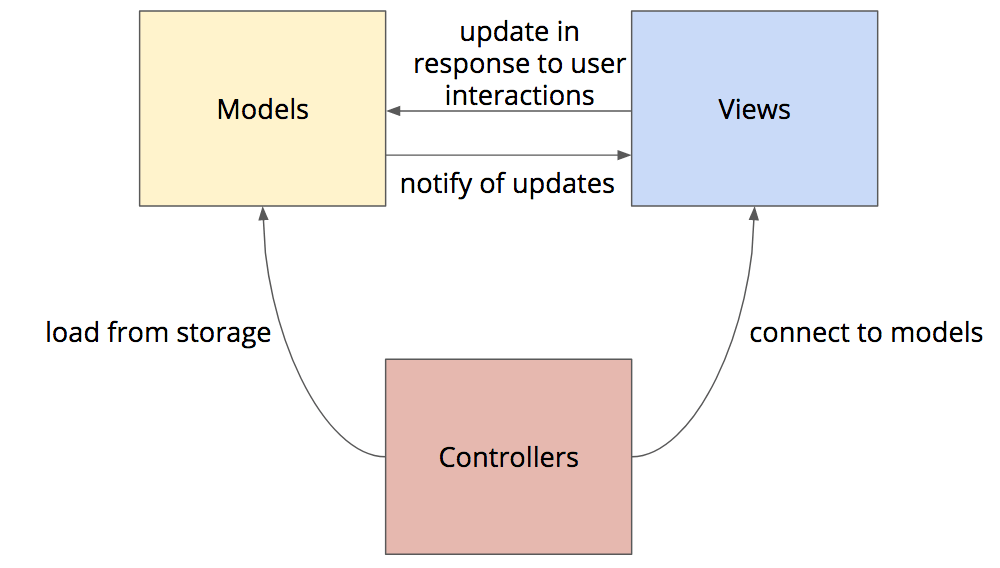

In the [Event-Driven Architecture Tutorial](../eventarch/) I showed you how to build interactive web applications using event listener functions that modify the application's state and re-render that state to the page. That architecture was a simple form of a much more pervasive and powerful architectural pattern known as **Model-View-Controller (MVC)**. Most JavaScript application frameworks are based on some variation of the MVC pattern, so before we dive into learning one of those frameworks, we should try to understand the MVC pattern in general. This will also help you understand what those frameworks are actually doing for you.

MVC was developed in the early days of personal computers, graphical user interfaces (GUIs), and object-oriented programming (OOP). These new platforms and tools enabled new kinds of interactive applications that required new approaches to code architecture. It was not at all immediately obvious how one should architect something as complex as a spreadsheet or word processing application. Developers experimented with many options before eventually settling on the MVC pattern. It worked so well that it became the standard architecture for GUI applications. Once JavaScript and the DOM matured, the MVC pattern was applied to client-side web applications as well, resulting in several competing libraries/frameworks (e.g., React, Angular, Vue, etc.).

To understand MVC, let's look at each of the concepts in turn, and see how they are applied in a simple JavaScript application.

## Models

The **Model** part of Model-View-Controller refers to a data objects that are being manipulated by the application. A model is simply an instance of a class (in the OOP sense) that is responsible for managing some chunk of data. It ensures that the data is created and modified correctly according to the rules of the application. The model is also responsible for raising an event when the data inside the model changes.

Note that models only care about the data they manage. Models do not render that data to the screen, nor do they handle saving that data to some kind of persistent data store. Their only concern is enforcing the application's rules regarding changes to those data, and notifying anyone who cares about changes to that data. Models are the most narcissistic of objects: they only know and care about about themselves.

For example, if we were to build a simple task list application using the MVC architecture, we would define two models: `Task` and `TaskList`. The `Task` model would manage the data for a specific task and enforce rules (e.g., the task title must be non-blank). The `TaskList` would manage the overall list of tasks. Both models would also allow callers to add event listener functions that will be called whenever the data inside the model changes, similar to how the DOM allows us to add an event listener function that is called when users click on elements or press keys on the keyboard.

## Views

A **view** is an object that is responsible for rendering a model to an output device (typically the screen, but perhaps a printer). The view doesn't manage the data: that's the model's job. The view just reads the data from the model and renders it to the output device. It also listens for change events raised by the model and automatically re-renders itself whenever the model changes.

How the view renders the model is up to the view, and different views might render the same model in different ways. For example, a `TaskListView` might render a `TaskList` model as a simple bulleted list, but a `TaskCalendarView` might render the `TaskList` as a set of events on a calendar, and a `TaskSummaryView` might render some summary statistics like the number of completed and uncompleted tasks. All of those views could render the same `TaskList`, and all of them could render to the screen _at the same time_. Since they are all rendering the same model, any changes to that model would cause all views to automatically re-render so that they always show the correct up-to-date data.

## Controllers

A **controller** is an object that is responsible for loading/saving models from/to persistent storage, and connecting those models to views. In the original MVC architecture, the controller was also the component responsible for handling user events (mouse and keyboard interactions) and updating the models in response. In more recent variations of MVC, the views assume that responsibility, as they are the ones creating the on-screen elements, and are thus better equipped to handle the events raised by those elements. In this newer style, views know about models, but they do not know anything about the controllers that connect them to those models.

The following illustrates these relationships:



## MVC in JavaScript

Let's see how this MVC architecture would be applied to a web application written in JavaScript. Since MVC is an object-oriented architecture, I will use the new [ES6 Class Syntax](../es6/) to define the various components. Note that this class syntax may not be supported in older browsers, but it can be compiled to simpler JavaScript that all browsers can understand using [Babel](http://babeljs.io/).

### Models

Let's start by creating a base class for all models. This base class will manage a list of change event listener functions that will be invoked whenever the model needs to inform listeners that its data has changed. As I define the methods of this class, I'll also add [JSDoc](http://usejsdoc.org/) annotations to provide some typing information for parameters that editors like Visual Studio Code can leverage and enforce.

```javascript
/**
 * Base class for all models
 */
class Model {
    constructor() {
        //array of change event listeners
        this._listeners = [];
    }

    /**
     * Adds a listener function that will be called when the model changes
     * @param {function} listener 
     * @returns {Model}
     */
    addChangeListener(listener) {
        //push the new listener function into the array
        this._listeners.push(listener);
        return this;
    }

    /**
     * Removes a change listener function
     * @param {function} listener 
     * @returns {Model}
     */
    removeChangeListener(listener) {
        //filter out the listener to remove
        this._listeners = this._listeners.filter(l => l !== listener);
        return this;
    }

    /**
     * Raises an change event
     * @returns {Model}
     */
    raiseChange() {
        //call the listener functions
        this._listeners.forEach(listener => listener());
        return this;
    }

    /**
     * Bubbles change events from another model up through this one
     * @param {Model} model 
     * @returns {Model}
     */
    bubbleChange(model) {
        model.addChangeListener(() => this.raiseChange());
        return this;
    }
}
```

The `_` prefix on `_listeners` is a common idiom that JavaScript developers use to signal that `_listeners` should be treated as an internal private property. Since JavaScript doesn't have a `private` keyword, and since all JavaScript objects are really just maps, it's difficult to truly hide and protect a property from calling code. To help other developers understand that this property is something they shouldn't mess with, we use a prefix like `_` to signal that it should be treated as if it was a private data member.

The `raiseChange()` method will be called by subclasses whenever their data changes. This method will iterate over the array of listener functions and invoke each them in turn. Since functions are values in JavaScript, they can be added to an array as an element, and invoked while iterating those array elements. The `listener` parameter passed to the lambda function will be set to each listener function as it iterates the array. The expression `listener()` then invokes that function.

The `bubbleChange()` is used to bubble-up change events from a child model through a parent model. For example, our `TaskList` model will contain a list of `Task` models as children, and if one of those `Task` models change, we want to raise a change event from the `TaskList` model as well since it's contents have also changed. That way, any view listening for change events on the `TaskList` will be notified when one of the tasks within the list is changed, or when the overall list of tasks changes. This bubbling of events is done by adding a change listener to the child model that simply calls `raiseChange()` on the parent model.

#### Task Model

Now that we have a base class, let's define a model for a single `Task`. We will also use JSDoc to define a type named `TaskProps`, which will describe a simple JavaScript object with two properties: `title` and `done`. This simple map can be passed to the `Task` constructor to initialize it.

```javascript
/**
 * Represents a map of bare properties for a task
 * @typedef TaskProps
 * @property {string} title
 * @property {boolean} [done]
 */

/**
 * Represents a single task
 */
class Task extends Model {
    /**
     * Constructs a new task with an optional
     * set of initial properties
     * @param {TaskProps} [props]
     */
    constructor(props) {
        super();
        if (props) {
	        this._title = props.title;
	        this._done = props.done;        	
        }
    }

    /**
     * Returns the task's title
     * @returns {string}
     */
    get title() {
        return this._title;
    }

    /**
     * Sets the task's title
     * @param {string} title 
     */
    set title(title) {
        if (!title || title.length === 0) {
            throw new Error("title must be non-blank");
        }
        this._title = title;
        this.raiseChange();
    }

    /**
     * Returns the task's done state
     * @returns {boolean}
     */
    get done() {
        return this._done;
    }

    /**
     * Sets the task's done state
     * @param {boolean} done 
     */
    set done(done) {
        this._done = done;
        this.raiseChange();
    }

    /**
     * Toggles the task's done state
     * @returns {Task}
     */
    toggleDone() {
        this._done = !this._done;
        this.raiseChange();
        return this;
    }

    /**
     * Converts this model into a simple object for
     * JSON serialization
     * @returns {TaskProps}
     */
    toJSON() {
        return {
            title: this._title, 
            done: this._done
        };
    }
}
```

In typical Object-Oriented fashion, our `Task` class inherits all the methods from `Model` because it `extends` that class. But our constructor enhances the base class constructor by accepting a plain JavaScript object (i.e., a simple map) that may contain some initial values for `title` and `done`. So one can initialize a `Task` object like so:

```javascript
let task = new Task({title: "Test", done: false});
```

This will come in handy when loading a list of tasks that we previously saved to a server or [local storage](https://developer.mozilla.org/en-US/docs/Web/API/Window/localStorage).

We then add some specific methods for tasks, many of which use the relatively new getter/setter syntax from ES5. The function `get title()` will be invoked whenever code tries to get the `title` property from an instance of `Task` and the `set title()` will be invoked whenever code tries to set the `title` property. For example:

```javascript
let task = new Task();
//this statement invokes `set title()`
task.title = "Test"
//and this statement invokes `get title()`
let title = task.title;
```

These getter/setter methods allow us to expose what appear to be simple properties on our model, but when they are set, our setter function gets a chance to validate the data and throw an error. We can use this to ensure that the title property is never set to a blank string.

> **Note:** you could of course just call this method `setTitle()` and invoke it as such from other code. The only real difference is how the calling code interacts with the object: `task.title = "Test"` vs. `task.setTitle("Test")`. From the model's perspective, both approaches invoke a function that gets a chance to validate the data.

All functions in the `Task` model that modify data call `this.raiseChange()`, which is a method we defined on the base `Model` class. This method iterates over all the change listener functions and invokes each. That way anyone who needs to know when this model's data changes will be notified.

The last method to explain is `toJSON()`. This method will be invoked if this object is passed to the `JSON.stringify()` method. This method converts JavaScript objects into the portable string-based format known as [JSON](../ajax/#secjson) and by default it will encode all properties of the object. If you don't want that, you implement a `toJSON()` method and return whatever you do want the JSON encoder to encode. In our case, we only want the `_title` and `_done` properties to be encoded, and we want them to be encoded with the names `title` and `done`. So our `toJSON()` method returns a simple object with only those two properties.

#### TaskList Model

Now that we have model for a single task, let's define another one for a list of tasks:

```javascript
/**
 * Represents a list of tasks
 */
class TaskList extends Model {
    /**
     * Constructs a new task list with
     * an optional array of task props
     * @param {TaskProps[]} [taskPropsArray]
     */
    constructor(taskPropsArray) {
        super();
        //if a taskPropsArray was provided...
        if (taskPropsArray) {
            //map it into an array of Task objects
            this._tasks = taskPropsArray.map(tp => new Task(tp));
            //bubble-up change events raised by the Task objects
            this._tasks.forEach(task => this.bubbleChange(task));
        } else {
            //initialize to an empty array
            this._tasks = [];
        }
    }

    /**
     * Returns the total number of tasks
     * @returns {number}
     */
    get length() {
        return this._tasks.length;
    }

    /**
     * Returns the count of tasks that are done
     * @returns {number}
     */
    get doneLength() {
        return this._tasks.reduce((count, task) => task.done ? count + 1: count, 0);
    }

    /**
     * Returns a new array containing all Task objects
     * that one can iterate over without disturbing the
     * master array maintained by this object
     * @returns {Task[]}
     */
    all() {
        return this._tasks.slice(0);
    }

    /**
     * Adds a new task to the list
     * @param {Task} task 
     */
    add(task) {
        //push the new task into the array
        this._tasks.push(task);
        this.bubbleChange(task);
        this.raiseChange();
    }

    /**
     * Purges all done tasks from the list
     */
    purgeDone() {
        //filter the array of tasks to include only those
        //that are not yet done
        this._tasks = this._tasks.filter(t => !t.done);
        this.raiseChange();
    }

    /**
     * Converts this model into a simple object for
     * JSON serialization
     * @returns {Task[]}
     */
    toJSON() {
        return this._tasks;
    }
}
```

This class also extends `Model` and it's constructor also accepts an initialization property, but this time it's an simple JavaScript array of simple JavaScript objects, each of which can have a `title` and `done` property. This allows us to initialize a `TaskList` with a data array we receive from a server or read from local storage. Since it's an array, and since we essentially want to map each plain JavaScript object to a `Task` object, we use the `.map()` method. As you might remember from the [functional programming tutorial](../jsfunctional/), the `.map()` method invokes the provided function once for each element in the source array. Whatever that function returns is pushed into the output array. Here we return a new `Task()` that is initialized with the simple JavaScript object containing task properties. This allows us to initialize a `TaskList` like so:

```javascript
//data we got from a server or from local storage
let data = [
	{title: "Learn MVC"},
	{title: "Buy Dr Stearns a Tesla Roadster"}
];

//create a new task list initialized with the data
let taskList = new TaskList(data);

//taskList now has two tasks
taskList.length; // => 2
taskList[0].title // => "Learn MVC"
```

Note that during the constructor and the `add()` method, we also call `this.bubbleChange(task)` on each of the tasks in the list. As noted earlier, this will cause change events to bubble-up from individual tasks to the task list as a whole. In other words, when a single `Task` in the list raises a change event, the overall `TaskList` will raise a change event as well.

The use of `.slice()` in the `all()` method requires a little explanation. Calling `.slice(0)` on an array returns a shallow copy of that array, and this is what we want to return to the caller. We copy the array so that if the caller modifies the array's membership, it won't affect the `TaskList`. This requires calling code to add tasks to the list using `add()`, which guarantees that we can call `.bubbleChange()` and `.raiseChange()` to let listeners know about the new `Task` that was added to the list.

### Views

Now that we have our models defined, we next need to create some view classes that can render those models. In a GUI system, views typically render by erasing an area of the screen and redrawing the pixels in that area. In a web browser, we need to render a bit differently. Instead of drawing pixels, we need to create, populate, and return a subtree of _HTML elements_. The browser then takes care of erasing the area where those elements should be and drawing the pixels to represent the elements. So our views essentially need to translate one data structure into another. They should have a `render()` method that returns a tree of HTML elements that we can append into the existing page.

Let's start by defining a `View` base class, just like we defined a `Model` base class. This `View` base class doesn't have to do much at present, but by defining one, we can always add functionality to the base class later, and all derived classes will automatically inherit it.

```javascript
class View {
    /**
     * Returns an HTML element that contains the rendered view
     * @returns {HTMLElement}
     */
    render() {return undefined;}
}
```

Next let's define a subclass that can render a `TaskList` as a simple unordered HTML list (`<ul>` and `<li>` elements).

```javascript
/**
 * Renders a TaskList as a simple unordered list
 */
class TaskListView extends View {
    /**
     * Constructs the view
     * @param {TaskList} taskList 
     */
    constructor(taskList) {
        super();
        this._taskList = taskList;
    }

    render() {
    	//create a <ul> for the list
        let ul = document.createElement("ul");

        //for each Task in the list...
        this._taskList.all().forEach(task => {
        	//create an <li> and append it to the <ul>
            let li = ul.appendChild(document.createElement("li"));
            //set the textContent to the task title
            li.textContent = task.title;
            //add a "clickable" style class which we will
            //define in our CSS
            li.classList.add("clickable");
            //if the task is marked as done, add a "done"
            //style class, which we will define in our CSS
            if (task.done) {
                li.classList.add("done");
            }
            //add a click event listener that calls toggleDone()
			li.addEventListener("click", () => task.toggleDone());
        });

        //return the <ul> element
        return ul;
    }
}
```

### Controller

The controller is responsible for loading models from storage, saving them back to storage, and connecting models with views. In a JavaScript web application, the controller's code is often just statements at the global score that run when the page first loads. You can create a class, and then instantiate that class on page load, but it's often unnecessary to do so.

#### Storage

Let's start by seeing how we can load our `TaskList` from local storage. The `localStorage` object in the DOM gives our page access to a private space where we can save some data on the client. That space is private to your page's **origin**, which is the combination of the protocol (`http` or `https`) used to load your page, the host name the page came from (e.g., `ischool.uw.edu`), and the port number on that host the browser is talking to (by default `80` for `http` or 443 for `https`, but servers can listen on any port they wish). Any page loaded from the same origin has access to the same local storage space, and pages loaded from a different origin will have a separate local storage space.

The `localStorage` API acts like a key/value store, which is like a persistent map. You may store many keys with associated values, and you can ask for the value associated with any key. The one catch is that all keys and values must be strings. Thankfully any JavaScript Array or Object can be encoded into a string using `JSON.stringify()` and parsed back into an Array or Object using `JSON.parse()`.

```javascript
//load saved tasks from storage and parse them into a simple JavaScript array
let taskProps = JSON.parse(localStorage.getItem("tasks"));
//create a TaskList initializing it with the array
let taskList = new TaskList(taskProps);
```

The `localStorage.getItem()` method returns a JSON string previously saved to local storage associated with the `"tasks"` key. We then parse this into a JavaScript array of objects using `JSON.parse()` (more on JSON format in the [Making HTTP Requests Tutorial](../ajax/#secjson)). Since our `TaskList` accepts an array of objects as an initializer, we can simply pass this to the constructor to reload our previously-saved tasks.

That loads the tasks, but now we also need to save them whenever the `TaskList` changes. Thankfully we already defined a mechanism that lets one register a function to be called whenever the model changes. We can use that to re-save the list each time it changes:

```javascript
//add a change listener that re-saves the task list to local storage
taskList.addChangeListener(() => localStorage.setItem("tasks", JSON.stringify(taskList)));
```

Here we use the `JSON.stringify()` method to encode the `TaskList` back into a JSON string, and `.setItem()` to save that string to local storage.

#### Connecting Models to Views

After loading the `TaskList` from storage, the controller needs to create the view and connect it to the model. That requires just one line of code.

```javascript
//create the task list view and pass it a reference to the model
let taskListView = new TaskListView(taskList);
```

#### Rendering

Now that we have a model, and a view connected to that model, we just need to render the view into an existing element, and re-render it whenever the model changes. We can use a few helper functions to keep this clean.

```javascript
/**
 * Renders the overall app view to the parent element
 * @param {View} appView 
 * @param {HTMLElement} parentElement 
 */
function renderAppView(appView, parentElement) {
    //clear any content that might be there already
    parentElement.textContent = "";
    //render the app view into that parent element
    parentElement.appendChild(appView.render());    
}

/**
 * Renders the main application view
 * @param {Model} appModel
 * @param {View} appView 
 * @param {HTMLElement} parentElement 
 */
function renderApp(appModel, appView, parentElement) {
    //render the app view
    renderAppView(appView, parentElement);
    //add a change listener to the app model that automatically
    //re-renders the app view whenever the model changes
    appModel.addChangeListener(() => renderAppView(appView, parentElement));
}

renderApp(taskList, taskListView, document.querySelector("#app"));
```

The `renderAppView()` function clears the parent element and appends whatever the view returns from its `render()` method. The `renderApp()` function calls that function once to do the initial render, and then adds a change event listener function that calls it again whenever the model changes. That way the elements in the web page will always be up-to-date with the data in the model!

## Better MVC Frameworks

This example was fairly simple, and the way I wrote it isn't terribly efficient: each time the model changes, we completely clear the parent element and re-render everything. But this simplicity makes it easier to understand, and less error-prone, as we are always guaranteed that the page reflects the current state of the model. Current browsers are fairly efficient at redrawing, so if you run this you'll notice that the screen updates instantly and the app feel very snappy.

But as the models and views get larger and complex, all that modification of the DOM would start to get noticeable, both in terms of redraw performance and memory management. Thankfully, there are several MVC-like frameworks for JavaScript now that make it possible for us to write simple views that render their content, while minimizing the amount of elements that are destroyed and recreated each time we render (e.g., React, Vue). These frameworks use a bit of code in-between the views and the DOM that compare the rendered output of the views to what is already in the DOM. They then make the least amount of changes necessary to synchronize the two, resulting is far less DOM manipulation. These frameworks allow us to write large, sophisticated web applications based on the proven and reliable MVC pattern.


